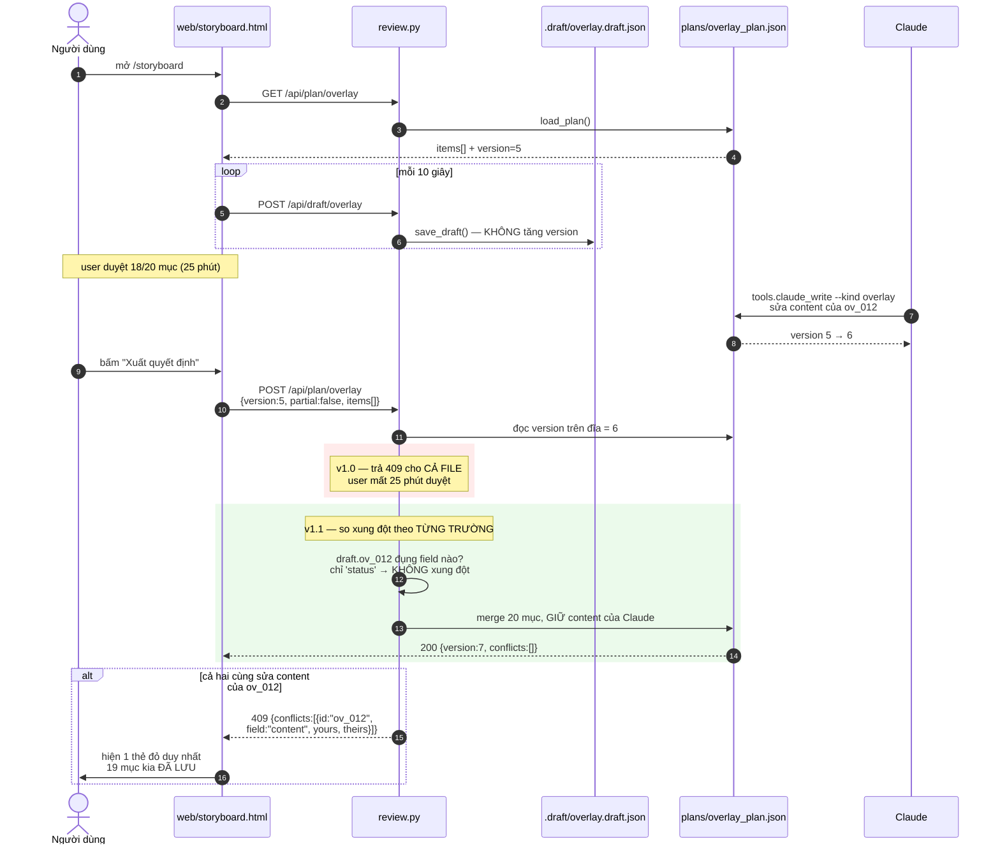
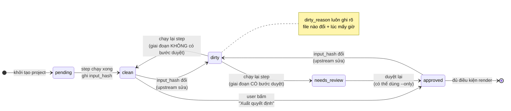
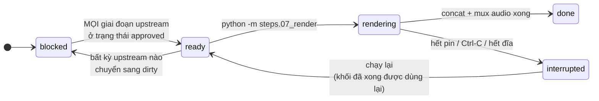
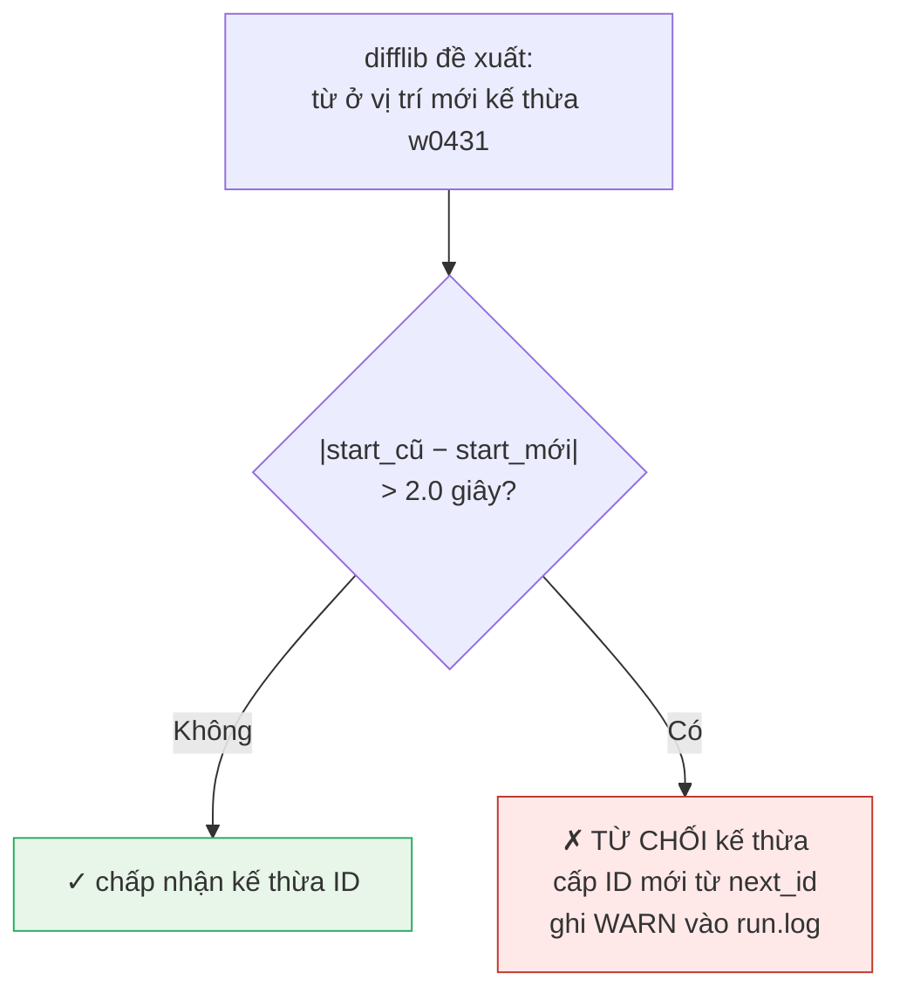
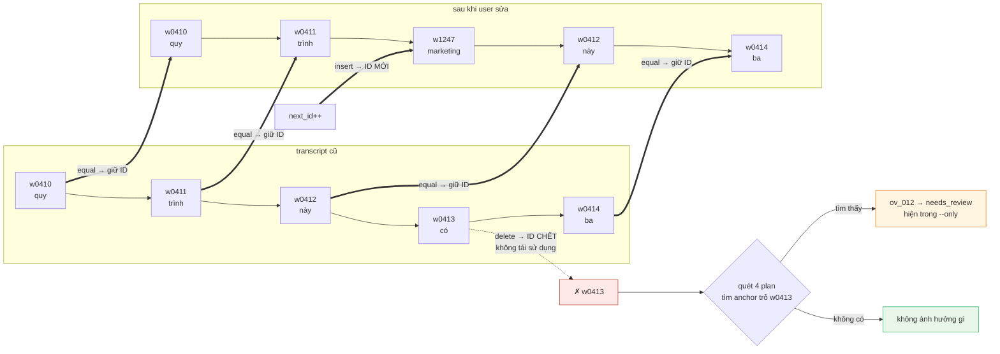
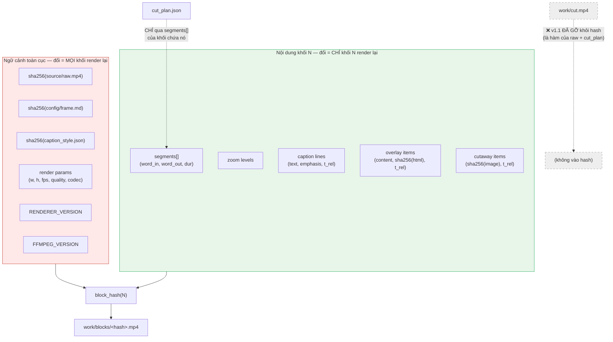

# Technical Design Document — AI Editor

> **Version:** 1.1 · **Ngày:** 16/08/2026 · **Author:** Phùng Đáp + Claude
> **Status:** Draft — sẵn sàng để implement (đã qua review senior, xem Changelog v1.1)
> **PRD reference:** `./PRD.md` (v2, 16/08/2026)

---

## 0. Bảng 9 quyết định kỹ thuật đã chốt

> Đọc bảng này trước. Mọi thiết kế phía dưới là hệ quả của 9 dòng này.

| # | Quyết định | Đã chốt | Ảnh hưởng tới section |
|---|---|---|---|
| 1 | Rủi ro HyperFrames | **Gắn chặt HyperFrames, gặp đâu sửa đó** — không spike trước. Giảm thiểu bằng cách gom mọi lời gọi vào 1 module `renderer.py` | §2.4, §6, §13 |
| 2 | Kiến trúc pipeline | **Lai** — script Python lo việc cơ khí, Claude lo việc phán đoán và ghi ra plan JSON | §2, §5, §7 |
| 3 | Lưu trạng thái | **File JSON rời** + ghi nguyên tử (`.tmp` → `os.replace`) + trường `version` chống ghi đè + bản nháp ra file `.draft` riêng | §3 |
| 4 | Neo ID từ | **ID một chiều, không tái sử dụng** + `difflib` diff dãy (khoá `(text, start)`, **chốt an toàn ±2s**) để kế thừa ID + `anchor_text` làm kiểm chứng tự động | §3.2, §5.6 |
| 5 | Trang duyệt | **Flask + Alpine.js**, một server ba route, không bước build | §4.2, §2.3 |
| 6 | Đồng bộ Variables | **Một chiều plan → Variables**. Cấm đọc ngược. Chốt an toàn `check_variables_sync.py` trước mọi lần render | §6.5 |
| 7 | Render tăng dần | **Khối định danh bằng mã băm nội dung** — ranh giới neo **word ID**, mọi thời điểm trong hash là **tương đối**, file đặt tên theo hash, có hash đúng thì bỏ qua | §6.2, §6.3 |
| 8 | Claude phán đoán | **Chạy trong phiên Cowork** + transcript rút gọn (giảm 80% token) + hợp đồng JSON có validate | §7 |
| 9 | Lộ trình build | **Lát cắt dọc** — đường ống mỏng đầu-cuối trước, làm dày sau | §14 |

---

## 1. Overview

### 1.1 Bài toán

Dựng 1 video talking-head 5–15 phút hiện tốn **cả ngày làm việc**: cắt khoảng lặng và từ đệm thủ công trên CapCut, mở tool riêng làm motion graphic, gắn caption từng dòng, và mỗi lần sửa 1 câu thoại là dựng lại + render lại từ đầu.

**Phạm vi MVP: đoạn ≤ 5 phút**, ràng buộc bởi RAM 8GB của máy hiện có. Video dài hơn nằm ngoài phạm vi — xem §17.

### 1.2 Giải pháp

Một **bộ skill + toolkit chạy local trong Claude Code / Cowork**. Người dùng đưa file video thô vào folder, ra lệnh bằng tiếng Việt. Hệ thống chạy một đường ống 7 công đoạn, dừng ở 3 điểm để người dùng duyệt trên trang web cục bộ, rồi render ra MP4 theo khối — sửa 1 câu chỉ render lại đúng khối chứa câu đó.

### 1.3 Scope của TDD này

**Bao gồm:** toàn bộ 5 feature MUST của PRD — cắt footage có duyệt, timeline + render HyperFrames, che jump cut (zoom + cutaway), caption karaoke tiếng Việt, motion graphics theo lời nói. Cùng với: kiến trúc dữ liệu neo ID, server duyệt, bộ 9 script nghiệm thu, quy ước code.

**Không bao gồm:** Lower-third, đổi khung chéo ngang↔dọc, video trên 5 phút, render cloud, xử lý âm thanh (khử ồn / chuẩn hoá / nhạc nền), nhiều người nói, ghép nhiều file nguồn.

### 1.4 Quyết định kiến trúc quan trọng

- **Không có database, không có server thường trú** — mọi trạng thái là file JSON trong thư mục project. Vì đây là công cụ 1 người dùng chạy local, và người dùng cần sửa tay được mọi file.
- **Không có frontend framework, không có bước build** — Flask phục vụ 3 file HTML tĩnh, Alpine.js nhúng thẳng. Vì máy chỉ có 8GB RAM và một bước build là thêm một chỗ để hỏng.
- **Không có logic "đánh dấu bẩn"** — trạng thái bẩn/sạch là hệ quả tự nhiên của mã băm nội dung, không phải code suy luận phụ thuộc. Vì code suy luận phụ thuộc là loại code sai âm thầm.
- **Claude không được đụng vào code pipeline** — Claude chỉ có quyền ghi vào 4 file `*_plan.json` theo schema cố định. Vì đây là ranh giới giữ cho hệ thống lặp lại được.

> **Tại sao chọn cách này:** Cả 4 quyết định trên đều phục vụ đúng một mục tiêu — làm cho hệ thống **lặp lại được và sửa tay được** trên một máy chật. Solo dev không có ai để hỏi khi hỏng lúc 11h đêm, nên mọi thứ phải mở ra đọc được bằng mắt.

---

## 2. System Architecture

### 2.1 Sơ đồ tổng thể

```
┌────────────────────────────────────────────────────────────────┐
│                    NGƯỜI DÙNG (Phùng)                          │
│   Terminal: Claude Code / Cowork  ·  Trình duyệt: 3 trang duyệt│
└──────────────┬───────────────────────────┬─────────────────────┘
               │ tiếng Việt                │ HTTP (127.0.0.1:7788)
┌──────────────▼───────────────┐  ┌────────▼─────────────────────┐
│      CLAUDE (đạo diễn)       │  │   review.py (Flask)          │
│  · đọc transcript rút gọn    │  │   GET  /cut /cutaway         │
│  · tầng 3 nhận nói vấp       │  │        /storyboard           │
│  · chọn từ khoá caption      │  │   GET  /api/plan/<loai>      │
│  · lên kế hoạch overlay      │  │   POST /api/plan/<loai>      │
│  · lên kế hoạch cutaway      │  │   GET  /media/<path> (range) │
│  · chạy lệnh CLI, đọc log    │  │   POST /api/draft/<loai>     │
└──────────────┬───────────────┘  └────────┬─────────────────────┘
               │ ghi *_plan.json            │ ghi *_plan.json
               │ (qua validate_plan.py)     │ (qua atomic write)
┌──────────────▼────────────────────────────▼─────────────────────┐
│                    TẦNG DỮ LIỆU (file JSON)                     │
│  transcript.json · cut_plan.json · overlay_plan.json            │
│  cutaway_plan.json · caption_plan.json · project.json           │
│  render_manifest.json · stats.jsonl · .draft/*.draft.json       │
└──────────────┬──────────────────────────────────────────────────┘
               │ đọc/ghi
┌──────────────▼──────────────────────────────────────────────────┐
│                   PIPELINE (script Python)                      │
│  steps/01_transcript.py   → gọi ElevenLabs, gán ID              │
│  steps/02_detect_cuts.py  → tầng 1+2 khoảng lặng, từ đệm        │
│  steps/03_apply_cuts.py   → ffmpeg, tính lại timeline           │
│  steps/04_build_caption.py→ gom dòng, sinh .srt                 │
│  steps/05_build_overlay.py→ dựng HTML+GSAP từ overlay_plan      │
│  steps/06_build_cutaway.py→ khớp assets/, gọi Gemini            │
│  steps/07_render.py       → chia khối, băm, render, concat      │
│  lib/  anchor · plan_io · hashing · config · renderer           │
└──────┬──────────────────┬──────────────────┬────────────────────┘
       │                  │                  │
┌──────▼──────┐  ┌────────▼────────┐  ┌─────▼──────────────────┐
│   ffmpeg    │  │   HyperFrames   │  │  API ngoài             │
│   OpenCV    │  │   CLI + Studio  │  │  ElevenLabs Scribe     │
│   (local)   │  │   (local)       │  │  Gemini (sinh ảnh)     │
└─────────────┘  └─────────────────┘  └────────────────────────┘
```

> **Tại sao chọn cách này:** Ba khối (Claude / server duyệt / pipeline) đều ghi vào **cùng một tầng dữ liệu file JSON**, không gọi trực tiếp lẫn nhau. Nghĩa là bất kỳ khối nào chết thì hai khối kia vẫn chạy được, và anh có thể chạy pipeline không cần Claude khi đã quen tay.

### 2.2 Các thành phần chính

| Thành phần | Vai trò | Tech | Ước lượng dòng |
|---|---|---|---|
| **Claude (đạo diễn)** | 4 việc phán đoán, chạy CLI, đọc log, giải thích cho người dùng | Cowork session + `SKILL.md` | ~300 (SKILL.md) |
| **Pipeline steps** | 7 công đoạn cơ khí, chạy độc lập được | Python 3.11 | ~1.400 |
| **lib/** | Thư viện dùng chung: neo ID, đọc/ghi plan, băm, config, cầu nối HyperFrames | Python 3.11 | ~700 |
| **review.py** | Server duyệt cục bộ, 3 route | Flask 3.x | ~220 |
| **web/** | 3 trang duyệt | HTML + Alpine.js 3 (nhúng) + CSS viết tay | ~900 |
| **checks/** | 11 script nghiệm thu + 5 script kiểm kiến trúc | Python + Playwright | ~600 |
| **Cấu hình** | Ngưỡng cắt, từ đệm, thương hiệu, style caption | JSON + TXT + Markdown | — |

### 2.3 Cấu trúc thư mục project

```
project-video-abc/
├── source/
│   └── raw.mp4                     ← file gốc, KHÔNG BAO GIỜ bị ghi đè
├── work/                           ← mọi thứ máy sinh ra
│   ├── audio.m4a                   ← audio tách ra để gửi ElevenLabs
│   ├── cut.mp4                     ← footage sau khi áp cắt
│   ├── blocks/
│   │   ├── a3f9c2e1.mp4            ← khối render, tên = mã băm
│   │   ├── 7b04d5f8.mp4
│   │   └── ...
│   └── generated_images/           ← ảnh Gemini sinh, tách khỏi assets/
├── assets/                         ← ảnh của người dùng bỏ vào
├── hf/                             ← project HyperFrames
│   ├── project.hf
│   ├── variables.json              ← BẢN CHIẾU, sinh ra từ overlay_plan
│   └── scenes/
├── plans/                          ← TẦNG DỮ LIỆU — nguồn sự thật
│   ├── transcript.json
│   ├── cut_plan.json
│   ├── caption_plan.json
│   ├── overlay_plan.json
│   ├── cutaway_plan.json
│   ├── project.json                ← bảng trạng thái bẩn/sạch
│   └── render_manifest.json
├── .draft/                         ← bản nháp duyệt tự lưu 10 giây
├── config/
│   ├── cut_config.json
│   ├── filler_words.txt
│   ├── caption_style.json
│   └── frame.md
├── logs/
│   ├── stats.jsonl
│   └── run.log
├── out/
│   ├── final.mp4
│   └── final.srt
├── .env                            ← khoá API, trong .gitignore
└── Makefile
```

> **Tại sao chọn cách này:** `source/` và `plans/` là thứ đáng giữ; `work/` là thứ xoá đi lúc nào cũng được và dựng lại được. Ranh giới rõ ràng này cho phép `make clean` an toàn tuyệt đối và khiến việc sao lưu chỉ cần copy 2 thư mục.

### 2.4 Module `renderer.py` — hàng rào chống rủi ro HyperFrames

Quyết định 1 chọn gắn chặt HyperFrames mà không spike trước. Biện pháp giảm thiểu duy nhất: **mọi lời gọi tới HyperFrames đi qua đúng một file**.

```python
# lib/renderer.py — TOÀN BỘ tiếp xúc với HyperFrames nằm trong file này.
# Không file nào khác được import hyperframes hay chạy lệnh `hf ...`.

def hf_available() -> tuple[bool, str]:
    """Kiểm tra HyperFrames có cài và chạy được không. Trả (ok, phiên bản/lý do)."""

def create_project(project_dir: Path, width: int, height: int, fps: int) -> None: ...
def add_video_clip(scene_id: str, src: Path, t_in: float, t_out: float, zoom: float) -> None: ...
def add_caption_layer(scene_id: str, caption_items: list[dict], style: dict) -> None: ...
def add_overlay_layer(scene_id: str, html_path: Path, t_in: float, t_out: float) -> None: ...
def add_cutaway_layer(scene_id: str, image: Path, t_in: float, t_out: float) -> None: ...
def write_variables(vars_dict: dict) -> None: ...
def read_variables() -> dict: ...          # CHỈ dùng cho check_variables_sync.py
def render_block(block_id: str, t_in: float, t_out: float, out: Path, quality: str) -> None: ...
def open_studio() -> None: ...
```

Kèm một luật kiểm được: `checks/check_renderer_isolation.py` grep toàn bộ `steps/` và `checks/`, khẳng định không file nào ngoài `lib/renderer.py` nhắc tới `hyperframes` hoặc `hf `.

> **Tại sao chọn cách này:** Nếu HyperFrames không làm được caption karaoke hoặc không ghi được Variables từ ngoài, anh không phải đọc lại 2.000 dòng để tìm chỗ sửa — anh mở đúng 1 file 200 dòng. Chi phí của hàng rào này gần bằng 0; giá trị của nó bằng đúng xác suất giả định rủi ro cao nhất của dự án bị vỡ.

---

## 3. Data Model

> Dự án này **không dùng database**. Phần này mô tả schema của các file JSON — chúng đóng đúng vai trò của bảng, cột và quan hệ.
>
> **Tại sao không dùng DB:** PRD yêu cầu người dùng *"chữa chữ sai rồi chạy tiếp"* trên transcript và duyệt bằng cách sửa file. SQLite phá mất khả năng đó, và Claude thao tác JSON tự nhiên hơn SQL rất nhiều. Đổi lại phải tự lo chuyện tranh chấp ghi — giải quyết ở §3.6.

### 3.1 Quan hệ giữa các file

```
transcript.json  (bảng gốc — mọi thứ khác trỏ về đây)
   │  khoá chính: word.id  (w0001, w0002, ...)
   │
   ├──< cut_plan.json        anchor_start / anchor_end → word.id
   ├──< caption_plan.json    line.word_ids[]           → word.id
   ├──< overlay_plan.json    anchor_start / anchor_end → word.id
   └──< cutaway_plan.json    anchor_start / anchor_end → word.id

project.json          ← bảng trạng thái, băm đầu vào từng giai đoạn
render_manifest.json  ← danh sách khối + mã băm + đường dẫn file
stats.jsonl           ← nhật ký quyết định duyệt (append-only)
```

**Luật quan hệ (tương đương foreign key):** mọi `anchor_*` phải trỏ tới một `word.id` **đang tồn tại** trong `transcript.json`. Không có ràng buộc cấp DB, nên nó được thi hành bằng `checks/check_anchor_integrity.py` — chạy trong `make check` và tự động trước mỗi lần render.

### 3.2 `transcript.json` — bảng gốc

```json
{
  "schema_version": 1,
  "version": 7,
  "updated_at": "2026-08-16T14:32:07+07:00",
  "source_file": "source/raw.mp4",
  "source_sha256": "a3f9c2e1...",
  "duration_sec": 312.44,
  "language": "vi",
  "next_id": 1247,
  "words": [
    { "id": "w0410", "text": "quy",   "start": 187.220, "end": 187.410, "conf": 0.98 },
    { "id": "w0411", "text": "trình", "start": 187.410, "end": 187.680, "conf": 0.97 },
    { "id": "w0412", "text": "này",   "start": 187.680, "end": 187.850, "conf": 0.99 },
    { "id": "w0413", "text": "có",    "start": 187.850, "end": 187.990, "conf": 0.99 },
    { "id": "w0414", "text": "ba",    "start": 188.100, "end": 188.310, "conf": 0.96 },
    { "id": "w1247", "text": "rưỡi",  "start": 188.310, "end": 188.520, "conf": 0.91 },
    { "id": "w0415", "text": "bước",  "start": 188.520, "end": 188.900, "conf": 0.98 }
  ]
}
```

| Trường | Kiểu | Ý nghĩa | Ghi chú |
|---|---|---|---|
| `schema_version` | int | Phiên bản schema, để nâng cấp về sau | Mọi file plan đều có |
| `version` | int | Tăng 1 mỗi lần ghi — cơ chế chống ghi đè | Xem §3.6 |
| `source_sha256` | str | Băm file video gốc | Đổi file gốc = mọi thứ bẩn |
| `next_id` | int | Bộ đếm cấp phát ID, **chỉ tăng** | Trái tim của quyết định 4 |
| `words[].id` | str | `w` + 4 chữ số, **bất biến, không tái sử dụng** | Khoá chính |
| `words[].start/end` | float | Giây trên **timeline gốc** | Không phải timeline sau cắt |
| `words[].conf` | float | Độ tin cậy từ ElevenLabs | Dùng để gợi ý chỗ cần kiểm |

**Luật vàng:** thứ tự từ trong video xác định bằng **vị trí trong mảng `words`**, không bằng giá trị số của ID. Trong ví dụ trên `w1247` nằm giữa `w0414` và `w0415` — hoàn toàn hợp lệ.

> **Tại sao chọn cách này:** Nếu đánh số lại từ đầu mỗi lần sửa transcript, mọi neo trong 3 file plan kia sẽ trỏ sai chỗ **mà không báo lỗi** — vì ID vẫn tồn tại, chỉ là trỏ nhầm từ. Đó là loại hỏng tệ nhất: im lặng. ID một chiều biến nó thành hỏng ồn ào: ID mất hẳn, script bắt được ngay.

### 3.3 `cut_plan.json`

```json
{
  "schema_version": 1,
  "version": 12,
  "updated_at": "2026-08-16T14:32:07+07:00",
  "input_hash": "7c21ab...",
  "approved_at": "2026-08-16T14:32:07+07:00",
  "items": [
    {
      "id": "cut_014",
      "kind": "filler",
      "group": "B",
      "anchor_start": "w0412",
      "anchor_end": "w0412",
      "anchor_text": "thì",
      "t_start": 187.680,
      "t_end": 187.850,
      "tier": 0,
      "confidence": 0.62,
      "context": "quy trình này thì có ba bước",
      "absorbed_by": null,
      "status": "rejected",
      "decided_by": "user",
      "decided_at": "2026-08-16T14:31:50+07:00"
    },
    {
      "id": "cut_015",
      "kind": "retake",
      "anchor_start": "w0389",
      "anchor_end": "w0409",
      "anchor_text": "cái phễu này có ba bước cắt cắt",
      "t_start": 182.100,
      "t_end": 187.220,
      "tier": 1,
      "confidence": 0.99,
      "context": "...",
      "absorbed_by": null,
      "status": "accepted",
      "decided_by": "auto",
      "decided_at": "2026-08-16T14:28:03+07:00"
    },
    {
      "id": "cut_016",
      "kind": "silence",
      "anchor_start": "w0413",
      "anchor_end": "w0414",
      "anchor_text": "có → ba",
      "gap_original_ms": 2400,
      "keep_ms": 400,
      "absorbed_by": null,
      "status": "accepted",
      "decided_by": "auto"
    }
  ]
}
```

**Neo cho `kind=silence` (định nghĩa ở v1.1).** Khoảng lặng nằm **giữa** hai từ, nó không phải một từ — nên nó neo vào **cặp từ kẹp**: `anchor_start` = từ cuối trước khoảng lặng, `anchor_end` = từ đầu sau khoảng lặng, `anchor_text` dạng `"có → ba"`. Và giây của nó **không suy ra được từ neo** (cắt 2.4s xuống 400ms phụ thuộc `trim_long_to_ms` trong config, không phụ thuộc neo) — nên `gap_original_ms` và `keep_ms` được ghi lại để tái lập chính xác.

Luật kèm theo: cả hai từ kẹp còn sống thì neo hợp lệ; **một trong hai bị cắt → khoảng lặng hợp nhất vào cut nuốt nó** (`absorbed_by`), không trở thành neo mồ côi. Thiếu luật này, `check_anchor_integrity.py` báo mồ côi hàng loạt ở mọi video có retake.

| Trường | Kiểu | Giá trị hợp lệ |
|---|---|---|
| `kind` | str | `silence` · `filler` · `retake` |
| `group` | str \| null | `A` (cắt tự động) · `B` (chỉ đề xuất) — chỉ có với `kind=filler` |
| `tier` | int | `0` = không qua 3 tầng · `1` = từ khoá "cắt cắt" · `2` = so khớp văn bản · `3` = Claude đọc ngữ cảnh |
| `confidence` | float | 0.0–1.0 |
| `anchor_text` | str | **Nguyên văn cụm từ lúc tạo neo** — dùng để kiểm chứng, không dùng để neo |
| `t_start` / `t_end` | float | Suy ra từ neo, **ghi vào file chỉ để đọc bằng mắt**; script luôn tính lại từ neo |
| `status` | str | `pending` · **`accepted`** · `rejected` |
| `decided_by` | str | `auto` · `user` · `claude` |
| `absorbed_by` | str \| null | ID của cut cha nuốt trọn cut này — xem §5.2 bước 2.5 |
| `gap_original_ms` / `keep_ms` | int | **Chỉ có với `kind=silence`** — giây không suy được từ neo |

> **Đổi tên `applied` → `accepted` (v1.1):** `applied` dùng cho cut được duyệt **trước khi** `03_apply_cuts.py` chạy, nhưng đọc "applied" ai cũng hiểu là "đã cắt xong rồi". Người viết `steps/03` sẽ băn khoăn có nên lọc `status != applied` không, và hoàn toàn có thể viết ra bản chạy hai lần cắt hai lần. Một từ, hết mơ hồ.

> **Tại sao có cả `anchor_text` lẫn `t_start`:** `anchor_text` là **cơ chế kiểm chứng** — trước render, script so nó với văn bản hiện tại tại neo đó; lệch thì cảnh báo. `t_start` là **tiện ích cho mắt người** — anh mở file ra biết ngay đang nói về giây nào, nhưng script không bao giờ tin nó. Ghi rõ chỗ nào máy tin, chỗ nào chỉ để đọc, là cách chống lẫn lộn về sau.

### 3.4 `overlay_plan.json` — chủ duy nhất của nội dung đồ hoạ

```json
{
  "schema_version": 1,
  "version": 5,
  "updated_at": "2026-08-16T15:10:22+07:00",
  "input_hash": "9b04ef...",
  "approved_at": "2026-08-16T15:10:22+07:00",
  "items": [
    {
      "id": "ov_007",
      "type": "con_so_nhay",
      "anchor_start": "w0412",
      "anchor_end": "w0429",
      "anchor_text": "quy trình này có ba bước",
      "trigger_sentence": "quy trình này có ba bước",
      "content": { "number": "3", "label": "bước" },
      "priority": 1,
      "position": "right_third",
      "status": "approved",
      "edited_fields": ["content.number"],
      "html_path": "hf/scenes/ov_007.html",
      "content_hash": "e81a44..."
    },
    {
      "id": "ov_008",
      "type": "danh_sach_bung_dan",
      "anchor_start": "w0433",
      "anchor_end": "w0488",
      "anchor_text": "bước một là thu hút bước hai là nuôi dưỡng bước ba là chốt",
      "content": {
        "items": [
          { "text": "Thu hút",    "reveal_at_word": "w0435" },
          { "text": "Nuôi dưỡng", "reveal_at_word": "w0452" },
          { "text": "Chốt",       "reveal_at_word": "w0471" }
        ]
      },
      "priority": 2,
      "position": "right_third",
      "status": "pending",
      "edited_fields": [],
      "html_path": null,
      "content_hash": null
    }
  ]
}
```

| `type` | Ưu tiên | Kích hoạt bởi |
|---|---|---|
| `con_so_nhay` | 1 | Con số / tỉ lệ được nói ra |
| `danh_sach_bung_dan` | 2 | Câu liệt kê ("có 3 bước…") |
| `card_khai_niem` | 3 | Câu định nghĩa một thuật ngữ |
| `pill_tu_khoa` | 4 | Từ khoá được nhấn mạnh |

`edited_fields[]` là **danh sách đường dẫn trường bất khả xâm phạm** — script sinh lại kế hoạch không được ghi đè đúng những đường dẫn này. Đây là cách thi hành lời hứa PRD *"sửa chữ trên storyboard → chữ đó không bị mất khi chạy lại pipeline"*.

**Khoá theo đường dẫn trường, không phải cờ boolean (v1.1).** v1.0 dùng `edited_by_user: true` ở cấp mục. Nhưng `content` của `danh_sach_bung_dan` là object có 3 mục con — anh sửa chữ mục thứ nhất thì **cả ba** bị khoá, Claude không cập nhật được `reveal_at_word` của hai mục kia nữa dù chúng chỉ là timing. Khoá theo đường dẫn giữ đúng phần anh đã đụng:

```json
"edited_fields": ["content.items[0].text", "content.number"]
```

**Đường gỡ khoá:** `python -m tools.unlock_item ov_007 [--field content.number]`. Không có lệnh này, sửa nhầm một chữ là mục đó bị đóng băng vĩnh viễn với Claude.

> **Tại sao chọn cách này:** Không có cơ chế khoá, mọi lần chạy lại pipeline Claude sẽ sinh lại nội dung đồ hoạ theo cách hiểu mới của nó, và chữ anh sửa tay biến mất. Bài test bắt buộc trong PRD (*"sửa chữ qua Variables → chạy lại toàn bộ pipeline → chữ vẫn là bản đã sửa"*) chính là kiểm cơ chế này.

### 3.5 `cutaway_plan.json` và `caption_plan.json`

**`cutaway_plan.json`**

```json
{
  "schema_version": 1, "version": 3, "input_hash": "d4f1...",
  "budget": { "api_calls_used": 6, "api_calls_limit": 10,
              "month_used": 47, "month_limit": 120, "est_cost_vnd": 4680 },
  "items": [
    {
      "id": "cta_004",
      "anchor_start": "w0512", "anchor_end": "w0547",
      "anchor_text": "cái phễu marketing nó giống như một cái phễu thật",
      "image_source": "ai_generated",
      "image_path": "work/generated_images/cta_004_v2.png",
      "prompt": "Sơ đồ phễu marketing 3 tầng, phẳng, tối giản, nền trắng",
      "regen_count": 2, "regen_limit": 3,
      "t_dur": 4.2,
      "status": "approved"
    }
  ]
}
```

`image_source` ∈ `user_asset` · `ai_generated` · `missing`.
`status: missing` xảy ra khi Gemini lỗi hoặc hết quota — video vẫn dựng được, chỉ thiếu mục đó.

**`caption_plan.json`**

```json
{
  "schema_version": 1, "version": 9, "input_hash": "b7c3...",
  "mode": "karaoke_word",
  "lines": [
    {
      "id": "cap_031",
      "word_ids": ["w0410","w0411","w0412","w0413","w0414","w0415"],
      "text": "quy trình này có ba bước",
      "emphasis_word_ids": ["w0414","w0415"],
      "t_start": 187.220, "t_end": 188.900,
      "line_break_after": 3
    }
  ]
}
```

`mode` ∈ `karaoke_word` (mặc định mọi video) · `word_pop` (chỉ video dọc dưới 2 phút, hệ thống tự chọn).
`emphasis_word_ids` tối đa 3 phần tử — luật cứng của PRD, `validate_plan.py` từ chối nếu vượt.

### 3.6 `plan_io.py` — ghi nguyên tử và chống ghi đè

Đây là module quan trọng nhất trong `lib/`. Mọi lần đọc/ghi plan đều đi qua nó, không có ngoại lệ.

```python
# lib/plan_io.py

class PlanConflict(Exception):
    """Version trên đĩa khác version lúc đọc → có người khác đã ghi."""

def load_plan(path: Path) -> tuple[dict, int]:
    """Trả (nội dung, version_lúc_đọc)."""

def save_plan(path: Path, data: dict, expected_version: int, *, force=False) -> int:
    """
    1. Đọc lại version trên đĩa.
    2. Nếu != expected_version và không force → raise PlanConflict.
    3. data['version'] = expected_version + 1
    4. data['updated_at'] = now(tz='Asia/Saigon')
    5. Ghi ra path.with_suffix('.json.tmp')
    6. os.replace(tmp, path)      ← nguyên tử trên macOS (cùng filesystem)
    7. Trả version mới.
    """

def save_draft(kind: str, data: dict) -> None:
    """Ghi .draft/<kind>.draft.json — KHÔNG đụng file thật, không tăng version."""

def promote_draft(kind: str, *, partial=False, scope: list[str] | None = None) -> int:
    """
    Người dùng bấm 'Xuất quyết định'.

    KHÔNG ghi khối. MERGE THEO WHITELIST TRƯỜNG của kind (bảng §4.2):
      1. Đọc bản trên đĩa.
      2. Với mỗi mục trong draft: chỉ chép sang các trường trang đó ĐƯỢC PHÉP ghi.
         Mọi trường khác giữ nguyên bản đĩa — kể cả khi draft có giá trị cũ hơn.
      3. partial=True → CHỈ đụng các ID trong scope. Mục ngoài scope giữ nguyên
         TUYỆT ĐỐI, không được coi là đã xoá.
      4. Xung đột cấp TRƯỜNG (cả hai cùng sửa đúng một trường của một mục)
         → raise PlanConflict kèm danh sách conflicts, các mục còn lại VẪN LƯU.
      5. save_plan() phần đã merge.
    """
```

**Bốn luật cứng:**

1. Ghi bằng `.tmp` + `os.replace()` → không bao giờ tồn tại file JSON cụt giữa chừng, kể cả khi mất điện.
2. Kiểm `version` trước khi ghi → phát hiện được trường hợp Claude và trang duyệt cùng sửa một file.
3. Bản nháp tự lưu 10 giây ghi vào `.draft/`, **không đụng file thật** cho tới khi bấm "Xuất quyết định".
4. **Promote là merge theo whitelist trường, không phải ghi khối** (v1.1). Xung đột xét ở **cấp trường**, không ở cấp file.

> **Tại sao luật 4 (v1.1):** v1.0 định nghĩa `promote_draft()` là *".draft → file thật qua `save_plan()`"* — tức ghi nguyên khối. Nhưng `.draft` buộc phải chứa **toàn bộ** `items[]` (đó là điều kiện để "đóng tab mở lại nguyên trạng thái"), nên ghi khối sẽ đè lên cả trường `content` mà Claude vừa sửa — đúng thứ §4.2 tuyên bố không xảy ra. Hai section mô tả hai mô hình quyền mâu thuẫn nhau; luật 4 chọn dứt khoát một mô hình. Chi phí ~15 dòng. Không viết ra thì Claude sẽ implement bản ghi khối vì nó đơn giản hơn.

> **Tại sao chọn cách này:** Kịch bản thật sẽ xảy ra: anh mở `/storyboard` duyệt được 12/20 mục, rồi gõ cho Claude "sửa card thứ 3". Không có 3 luật này, 10 giây sau bản nháp tự lưu ghi đè mất sửa của Claude — **không một thông báo nào**. Ba luật này tốn khoảng 60 dòng và xoá bỏ hẳn cả một họ lỗi.

**Sơ đồ luồng — đây là luồng nhiều tác nhân ghi song song nhất trong hệ thống:**



### 3.7 `project.json` — bảng trạng thái bẩn/sạch

```json
{
  "schema_version": 1,
  "project_name": "video-abc",
  "created_at": "2026-08-16T09:00:00+07:00",
  "stages": {
    "transcript": {
      "inputs": ["source/raw.mp4", "config/cut_config.json"],
      "input_hash": "a3f9c2e1", "state": "clean",
      "approved_at": null, "completed_at": "2026-08-16T09:04:12+07:00"
    },
    "cut_plan": {
      "inputs": ["plans/transcript.json", "config/cut_config.json", "config/filler_words.txt"],
      "input_hash": "7c21ab90", "state": "approved",
      "approved_at": "2026-08-16T14:32:07+07:00"
    },
    "overlay_plan": {
      "inputs": ["plans/cut_plan.json", "config/frame.md"],
      "input_hash": "9b04ef11", "state": "dirty",
      "approved_at": "2026-08-16T15:10:22+07:00",
      "dirty_reason": "cut_plan.json đổi lúc 15:40:11"
    },
    "render": {
      "inputs": ["*"], "state": "blocked",
      "blocked_by": ["overlay_plan"]
    }
  }
}
```

`state` ∈ `pending` · `clean` · `approved` · `dirty` · **`needs_review`** · `blocked`.

**Máy trạng thái — luật chuyển bắt buộc (v1.1):**



Trạng thái `blocked` chỉ thuộc giai đoạn `render`, vẽ riêng:



> **Tại sao phải có `needs_review` (v1.1):** v1.0 liệt kê 5 trạng thái nhưng không có mũi tên nào giữa chúng. Chỗ hở lộ ra ngay khi vẽ sơ đồ: `dirty → clean` áp cho giai đoạn **có** bước duyệt sẽ khiến `cut_plan` bẩn, chạy lại `steps/02`, tự thành `clean`, rồi render đi tiếp — **bỏ qua bước duyệt của người dùng mà không báo gì**. Đúng loại hỏng im lặng mà cả TDD này được viết ra để tránh, và nó chỉ lộ ra ở video thật thứ ba nếu không vẽ sơ đồ.

Ra lệnh render khi còn giai đoạn `dirty` hoặc `needs_review` → **chặn lại và in đúng bảng này ra terminal**:

```
✗ Không thể render — còn 1 giai đoạn bẩn

  Giai đoạn      Trạng thái   Lý do
  ─────────────────────────────────────────────────────────
  transcript     sạch         —
  cut_plan       đã duyệt     —
  overlay_plan   BẨN ⚠        cut_plan.json đổi lúc 15:40:11
  render         chặn         chờ overlay_plan

  → Chạy: python review.py storyboard
```

> **Tại sao chọn cách này:** `project.json` **không phải nguồn sự thật**, nó là bản chụp lại kết quả của việc so mã băm. Chạy `make status` sẽ tính lại từ đầu và ghi đè nó. Nghĩa là file này hỏng cũng không sao — xoá đi là dựng lại được. Trạng thái duy nhất không tính lại được là `approved_at`, nên nó cũng được lưu song song trong chính file plan.

---

## 4. Interface Design

> Dự án không có REST API cho client bên ngoài. "API" ở đây gồm 2 bề mặt: **CLI** (Claude và người dùng gọi) và **HTTP nội bộ của `review.py`** (trang duyệt gọi).

### 4.1 CLI — bề mặt Claude điều khiển

```bash
# ── Đường ống chính ────────────────────────────────────────────
python -m steps.01_transcript  source/raw.mp4      # → plans/transcript.json
python -m steps.02_detect_cuts                     # → plans/cut_plan.json (pending)
python -m steps.03_apply_cuts                      # → work/cut.mp4 + timeline mới
python -m steps.04_build_caption                   # → plans/caption_plan.json + out/final.srt
python -m steps.05_build_overlay                   # → hf/scenes/*.html
python -m steps.06_build_cutaway                   # → work/generated_images/*
python -m steps.07_render      [--draft|--final]   # → out/final.mp4

# ── Trang duyệt ────────────────────────────────────────────────
python review.py cut | cutaway | storyboard

# ── Tiện ích ───────────────────────────────────────────────────
python -m tools.status                  # in bảng project.json
python -m tools.reanchor                # sau khi sửa transcript: diff + kế thừa ID
python -m tools.sync_variables          # sinh lại hf/variables.json từ overlay_plan
python -m tools.force_dirty <stage>     # ép render lại thủ công
python -m tools.clean_blocks            # xoá khối không thuộc bản dựng hiện tại
python -m tools.budget                  # in bộ đếm Gemini + ước tính chi phí

# ── Nghiệm thu ─────────────────────────────────────────────────
make check                              # chạy cả 11 script nghiệm thu
make check-fast                         # bỏ qua script cần render (dùng khi lặp nhanh)
```

**Quy ước chung cho mọi lệnh:**

| Quy ước | Chi tiết |
|---|---|
| Mã thoát | `0` thành công · `1` lỗi nghiệp vụ (có thông báo tiếng Việt) · `2` lỗi hệ thống |
| Thất bại | In lỗi tiếng Việt **kèm lệnh gợi ý chạy tiếp**, không in stack trace trừ khi `--verbose` |
| `--dry-run` | Mọi step hỗ trợ: in ra sẽ làm gì, không ghi file |
| `--json` | In kết quả dạng JSON một dòng ra stdout — **để Claude đọc, không phải để người đọc** |
| Ghi log | Mọi lệnh nối thêm vào `logs/run.log` với timestamp |

> **Tại sao chọn cách này:** Cờ `--json` là cầu nối quan trọng nhất giữa Claude và pipeline. Không có nó, Claude phải đọc hiểu văn bản tiếng Việt do script in ra — vừa tốn token vừa dễ hiểu sai. Có nó, Claude đọc đúng một dòng `{"ok":true,"cuts":42,"auto":18,"pending":24}` và biết chính xác chuyện gì xảy ra.

### 4.2 HTTP — `review.py`

```
Base: http://127.0.0.1:7788   (cổng bận → tự nhảy 7789, 7790... và in URL mới)

── Trang ─────────────────────────────────────────────────────────
GET  /cut                      Trang duyệt điểm cắt
GET  /cutaway                  Trang duyệt cutaway (storyboard ảnh)
GET  /storyboard               Trang duyệt đồ hoạ (bản động, phát được)
GET  /static/<path>            CSS/JS (Alpine.js nhúng sẵn)

── Dữ liệu ───────────────────────────────────────────────────────
GET  /api/plan/<kind>          Nạp plan + version hiện tại
                               kind ∈ cut | cutaway | overlay
POST /api/plan/<kind>          "Xuất quyết định" → MERGE theo whitelist trường
                               Body: { version, partial, scope[], items[] }
                               409 CHỈ khi xung đột cấp TRƯỜNG
POST /api/draft/<kind>         Tự lưu nháp (client gọi mỗi 10 giây)
                               Body: { items[] } → ghi .draft/, không tăng version
GET  /api/draft/<kind>         Mở lại tab → khôi phục trạng thái duyệt
GET  /api/transcript           Transcript đầy đủ (cho trang /cut)
GET  /api/budget               { api_calls_used, api_calls_limit,
                               month_used, month_limit, est_cost_vnd }

── Media (bắt buộc hỗ trợ HTTP Range) ────────────────────────────
GET  /media/<path>             Video/audio/ảnh trong thư mục project
                               Flask send_file(conditional=True)
                               Chặn path traversal — xem §10.2

── Vòng đời ──────────────────────────────────────────────────────
POST /api/shutdown             Server tự tắt sau khi lưu thành công
```

**Bảng quyền ghi theo từng trang — luật cứng (v1.1):**

| Trang | Được ghi trường | Cấm chạm |
|---|---|---|
| `/cut` | `status`, `decided_by`, `decided_at` | mọi trường khác |
| `/cutaway` | `status`, `image_path`, `prompt`, `regen_count`, `decided_*` | `anchor_*`, `t_dur`, `image_source` |
| `/storyboard` | `status`, `content`, `edited_fields`, `position`, `decided_*` | `anchor_*`, `type`, `priority`, `html_path`, `content_hash` |

`promote_draft()` chỉ chép sang các trường trong cột "Được ghi". Mọi trường khác giữ nguyên bản trên đĩa — kể cả khi draft mang giá trị khác.

**`POST /api/plan/<kind>` — Request:**

```json
{
  "version": 12,
  "partial": false,
  "scope": null,
  "items": [
    { "id": "cut_014", "status": "rejected", "decided_by": "user" },
    { "id": "cut_015", "status": "accepted", "decided_by": "user" }
  ]
}
```

Chế độ `--only` (§5.6) gửi:

```json
{ "version": 12, "partial": true, "scope": ["ov_012","cta_004"], "items": [ ... ] }
```

`partial: true` → server **chỉ** đụng các ID trong `scope`. Mọi ID ngoài scope giữ nguyên tuyệt đối, **không** được hiểu là đã xoá. `test_plan_io.py` bắt buộc có ca *"promote partial không được xoá mục ngoài scope"*.

**Response 200:**

```json
{
  "ok": true,
  "version": 13,
  "saved_at": "2026-08-16T14:32:07+07:00",
  "summary": { "kept": 14, "rejected": 6, "auto": 18 },
  "message": "Đã lưu · 14 mục giữ · 6 mục bỏ · 14:32:07"
}
```

**Response 409 — xung đột cấp TRƯỜNG (không phải cấp file):**

```json
{
  "ok": false,
  "error": "PLAN_CONFLICT",
  "message": "Đã lưu 19/20 mục. 1 mục cần anh quyết vì Claude cũng vừa sửa.",
  "version": 13,
  "saved": 19,
  "conflicts": [
    { "id": "ov_012", "field": "content",
      "yours":  { "number": "3", "label": "bước" },
      "theirs": { "number": "4", "label": "giai đoạn" },
      "theirs_at": "2026-08-16T14:30:02+07:00" }
  ]
}
```

Trang duyệt nhận `conflicts[]` và hiện **đúng số thẻ đỏ tương ứng**, không tải lại trang, không mất phần đã duyệt.

> **Tại sao 409 phải ở cấp trường (v1.1):** v1.0 trả 409 cho cả file kèm *"Tải lại trang để xem bản mới nhất"*. Đặt vào đúng kịch bản mà §3.6 đã mô tả: anh duyệt 18/20 mục trong 25 phút, Claude ghi một lần ở giữa, bấm "Xuất quyết định" → **409 → tải lại → mất sạch 25 phút**. Tệ hơn: draft vẫn mang `version` cũ nên lần promote sau lại 409 — vòng lặp chết. Xét xung đột ở cấp trường tốn thêm ~40 dòng và biến 409 từ "vứt đi làm lại" thành "xử lý 1 mục".
>
> **Chia quyền theo trường:** trang duyệt chỉ ghi được các trường trong bảng quyền ở trên. Claude sửa `content` trong lúc anh đang duyệt `status` → cả hai cùng sống, không ai mất gì. Rẻ hơn nhiều so với khoá file.

### 4.3 Ràng buộc bắt buộc của server duyệt

| Ràng buộc | Cách thi hành |
|---|---|
| Chỉ nghe `127.0.0.1` | `app.run(host="127.0.0.1")` — **không bao giờ** `0.0.0.0` |
| Chỉ phục vụ 4 thư mục media | Allowlist `work/ assets/ source/ out/` — §10.2. **Không** phục vụ `ROOT` |
| Cổng bận → tự nhảy | Thử 7788→7799, in URL thật **kèm token** ra terminal |
| Tự lưu nháp 10 giây | Alpine.js `setInterval` → `POST /api/draft/<kind>` |
| HTTP Range cho media | `send_file(..., conditional=True)` — Flask lo sẵn |
| Tự tắt sau khi lưu | `POST /api/shutdown` sau khi `/api/plan` trả 200 |
| Token phiên cho `/api/*` | `secrets.token_urlsafe(16)` + kiểm `Sec-Fetch-Site` — §10.2 |

---

## 5. Data Flow — 5 tính năng MUST

### 5.1 Sơ đồ luồng tổng

```
source/raw.mp4
    │
    ├─[CUT-a] ffmpeg tách audio ──→ ElevenLabs Scribe ──→ gán ID ──→ transcript.json
    │
    ├─[CUT-b] tầng 1 (từ khoá "cắt cắt") ──┐
    │         tầng 2 (so khớp 70%/15s)     ├──→ cut_plan.json (pending)
    │         khoảng lặng + từ đệm A/B     │
    │         tầng 3 (CLAUDE đọc ngữ cảnh) ─┘
    │                    │
    │              ⏸ DUYỆT /cut ──→ cut_plan.json (approved)
    │                    │
    ├─[CUT-c] ffmpeg áp cắt ──→ work/cut.mp4 + timeline mới (map ID → giây mới)
    │                    │
    │       ┌────────────┼────────────────┬──────────────────┐
    │       │            │                │                  │
    │ [CAP] caption  [MGX] overlay    [JMP] cutaway      [JMP] zoom
    │   CLAUDE chọn   CLAUDE quét     CLAUDE chọn       thuật toán
    │   từ khoá       4 kích hoạt     đoạn cần hình     luân phiên
    │       │            │                │             (OpenCV 1 lần)
    │       │            │            khớp assets/          │
    │       │            │            → Gemini nếu thiếu    │
    │       │            │                │                 │
    │  caption_plan  ⏸ DUYỆT       ⏸ DUYỆT /cutaway         │
    │   (không duyệt) /storyboard        │                  │
    │       │            │                │                 │
    │       └────────────┴────────────────┴─────────────────┘
    │                         │
    ├─[RND] renderer.py lắp 4 lớp lên timeline HyperFrames
    │           │
    │      chia khối 20–40s, ranh giới trượt tới điểm an toàn
    │           │
    │      băm từng khối → khối nào đã có file đúng băm thì BỎ QUA
    │           │
    │      render khối thiếu (1 tiến trình, đóng/mở lại browser mỗi khối)
    │           │
    │      ffmpeg concat (không mã hoá lại)
    │           │
    └──────→ out/final.mp4 + out/final.srt + hf/ (project sửa tiếp được)
```

### 5.2 [CUT] Feature 1 — Cắt sạch footage

**Bước 1: Transcript**

```
ffmpeg -i source/raw.mp4 -vn -c:a aac -b:a 64k work/audio.m4a
  → POST ElevenLabs Scribe (language=vi, timestamps=word)
  → thử lại tối đa 3 lần, backoff 2s/8s/32s, sau đó DỪNG (không chạy tiếp với transcript rỗng)
  → lib/normalize.py — CHUẨN HOÁ TIMESTAMP, bắt buộc chạy TRƯỚC khi gán ID
  → gán ID: w0001..wNNNN, next_id = N+1
  → chèn 2 ID biên: w0000 (BOF) và wEOF — không text, không hiện caption
  → plan_io.save_plan("plans/transcript.json", ...)
```

**`lib/normalize.py` — chuẩn hoá timestamp (v1.1)**

Tiếng Việt đơn âm, Scribe thường trả từ dài 40–60ms và **có** trả các ca bệnh sau:

```
· start == end (từ 0ms)
· từ sau có start < end của từ trước (chồng lấn)
· thứ tự trong mảng không tăng đơn điệu ở chỗ nói nhanh
```

Luật xử lý:

```
· ép tăng đơn điệu:  start[i] = max(start[i], end[i-1])
· từ có dur < 30ms → kéo dài tới 30ms, mượn từ khoảng lặng kề
· chồng lấn > 100ms → ghi WARN + kẹp về ranh giới
· ghi số ca đã sửa vào logs/run.log
```

**Phải chạy TRƯỚC khi gán ID, không phải sau.** Chuẩn hoá sau sẽ làm đổi `start` của từ đã có ID, mà chốt an toàn `difflib` ở §5.6 dựa vào chính `start` để chống căn lệch.

Không có bước này, hậu quả dây chuyền: `build_timeline_map()` trả khoảng âm, caption karaoke highlight nhảy lùi, `check_caption_timing.py` fail **ngẫu nhiên** 18/20 rồi 20/20 ở lần chạy sau — loại lỗi tốn cả buổi để hiểu.

**Hai ID biên `w0000` / `wEOF`.** Người quay bấm record rồi mới ngồi vào khung: 8 giây im lặng mở đầu. Cut khoảng lặng đó **không có từ đứng trước** để neo. Hai ID ảo này tồn tại chỉ để làm neo biên — rẻ hơn nhiều so với cho `anchor_start` nhận `null`, vì `null` sẽ len vào mọi hàm xử lý neo và mỗi hàm phải nhớ kiểm tra.

**Bước 2: Phát hiện — chạy tuần tự, tầng sau chỉ xét phần còn lại của tầng trước**

| Thứ tự | Cơ chế | Ai làm | Kết quả |
|---|---|---|---|
| 1 | Khoảng lặng theo bậc 600ms/1.5s | thuật toán | `kind=silence`, tự áp dụng |
| 2 | Tầng 1 — từ khoá "cắt cắt" | thuật toán | `tier=1`, `status=accepted` tự động |
| 3 | Tầng 2 — so khớp ≥70% trong 15s | thuật toán (`difflib` trên token đã bỏ dấu, bỏ từ đệm) | `tier=2`, `status=pending` |
| 4 | Từ đệm nhóm A (đứng một mình giữa 2 khoảng lặng) | thuật toán | `group=A`, `status=accepted` |
| 5 | Từ đệm nhóm B (giữa dòng chảy câu) | thuật toán | `group=B`, `status=pending`, hiện vàng |
| 6 | Tầng 3 — đổi hướng giữa câu | **Claude** | `tier=3`, `status=pending`, luôn vàng |

**Bước 2.5: Gộp chồng lấn — chạy sau khi cả 6 cơ chế xong (v1.1)**

Kịch bản xảy ra ngay video đầu tiên: tầng 2 phát hiện đoạn retake 5,1 giây (`w0389→w0409`), mà **bên trong** đoạn đó đã có sẵn 2 cut khoảng lặng + 1 filler nhóm A ở trạng thái `accepted`.

```
· cut nằm TRỌN trong một cut khác  → gán absorbed_by: "cut_015"
                                     GIỮ trong file, LOẠI khỏi mọi tính toán
· bác bỏ cut cha ở /cut            → mọi cut con trỏ về nó TỰ ĐỘNG SỐNG LẠI
· cut chồng lấn MỘT PHẦN           → CẤM. validate_plan.py từ chối ghi
```

Không có bước này, ba câu hỏi không ai trả lời được: cut con có tồn tại song song không, bác bỏ cut cha thì cut con ra sao, và `check_cut_coverage.py` đếm một đoạn retake chứa 3 cut con là 1 điểm cắt hay 4.

**Luật cứng thi hành trong code:**
- Không cắt từ đệm nếu nó là từ **đầu tiên hoặc cuối cùng** của câu có nghĩa (ranh giới câu = dấu chấm/hỏi/than, hoặc khoảng lặng > 1s)
- Từ khoá "cắt cắt" chỉ nhận khi đứng **liền sau khoảng lặng ≥300ms và trước khoảng lặng ≥300ms**; ca nghi ngờ đẩy xuống tầng 3, không tự cắt
- Mọi ngưỡng đọc từ `config/cut_config.json`, danh sách từ đệm từ `config/filler_words.txt` — `checks/check_no_hardcode.py` grep tìm số ma trong `steps/02_detect_cuts.py`

**Bước 3: Áp cắt và tính lại timeline**

```python
# lib/anchor.py
def build_timeline_map(transcript, cut_plan) -> dict[str, tuple[float, float]]:
    """
    Trả bảng tra: word_id → (start_mới, end_mới) trên timeline sau cắt.
    Từ bị cắt → không có trong bảng.
    Đây là hàm MỌI feature phía sau dùng để đổi neo thành giây.
    """
```

Giữ khoảng đệm tối thiểu **100ms mỗi đầu** đoạn giữ lại — chống mất chữ đầu/cuối câu.

> **Tại sao chọn cách này:** `build_timeline_map()` là **điểm duy nhất** trong hệ thống dịch từ neo ID sang giây. Caption, overlay, cutaway, render đều gọi nó. Một hàm, một nơi để sửa, một nơi để kiểm — thay vì bốn chỗ tự tính rồi lệch nhau 40ms mà không ai biết.

### 5.3 [CAP] Feature 4 — Caption karaoke

```
transcript.json + build_timeline_map()
    │
    ├─ gom dòng: ngắt ở dấu câu và ranh giới cụm từ
    │  · tối đa 2 dòng chữ/khối, ≤42 ký tự/dòng (ngang)
    │  · không ngắt giữa cụm có nghĩa (dò bằng danh sách cụm cố định + luật dấu câu)
    │  · nói quá nhanh → tách dòng ngắn hơn thay vì hiện chớp <0.5s
    │
    ├─ CLAUDE đánh dấu emphasis_word_ids (≤3/dòng): thuật ngữ, con số, tên công cụ
    │
    ├─ chọn mode: karaoke_word mặc định
    │             word_pop chỉ khi (khung dọc AND thời lượng < 120s)
    │
    ├─ caption_plan.json  ← KHÔNG có bước duyệt (PRD không yêu cầu)
    │
    ├─ renderer.add_caption_layer() → lớp 4, KHÔNG bị zoom
    └─ xuất out/final.srt theo timeline sau cắt
```

**Vùng cấm caption:** vùng khai báo trong `config/caption_style.json` (mặc định: đáy khung, cao 22%, cách mép đáy ≥8% chiều cao). Caption **đứng yên tuyệt đối**. Đồ hoạ và cutaway là bên phải né. `checks/check_layout.py` đối chiếu toạ độ, đạt = **0 mục lấn**.

**Font:** thiếu font khai báo → dùng font dự phòng **đã kiểm chứng dấu tiếng Việt** (Be Vietnam Pro → Noto Sans → system), báo rõ tên font thiếu. Không bao giờ âm thầm dựng bản vỡ dấu.

> **Tại sao caption là vùng cấm chứ không phải caption né:** Caption nhảy vị trí giữa video là lỗi hình người xem nhận ra ngay lập tức, còn đồ hoạ dịch sang trái 100px thì không ai biết. Chọn cho thứ dễ thấy đứng yên, thứ khó thấy nhường đường.

### 5.4 [JMP] Feature 3 — Zoom và cutaway

**Zoom — tự động, không duyệt**

```
OpenCV dò khung mặt trên 1 khung hình lúc khởi tạo project
    │
    ├─ thành công → tính max_safe_zoom từ khoảng cách mặt tới mép khung
    └─ thất bại   → max_safe_zoom = 1.04, báo rõ "không dò được khung mặt"
    │
    ghi vào config, gán mức luân phiên cho các đoạn liền kề:
    100% → 106% → 100% → 108% → ...
    · trong khoảng 100–110% VÀ ≤ max_safe_zoom
    · không lặp cùng mức ở 2 đoạn liền nhau
    · chuyển mượt kiểu Ken Burns
    · CHỈ áp lên lớp 1 (video người nói)
```

**Cutaway — có duyệt**

```
CLAUDE đọc transcript, xác định đoạn đang giải thích khái niệm
    │
    ├─ quét assets/ khớp hình có sẵn (khớp theo tên file + mô tả trong assets/index.md nếu có)
    │
    ├─ thiếu → kiểm hạn mức TRƯỚC KHI GỌI, cả BA trần:
    │          10 lượt/video · 120 lượt/tháng · 3 lần sinh lại/mục
    │          (sinh lại TÍNH VÀO cả hai trần đầu — xem §9.4)
    │          hết → dừng, báo rõ trần nào chạm, KHÔNG gọi API
    │          còn → Gemini API sinh ảnh theo tỉ lệ khung → work/generated_images/
    │
    ├─ Gemini lỗi/hết quota → status: missing, vẫn dựng phần còn lại
    │
    └─ cutaway_plan.json → ⏸ DUYỆT /cutaway → áp vào timeline (lớp 2)
```

**Luật áp dụng:**
- Cutaway không che mặt quá **8 giây liên tục**
- Đoạn giữ lại ngắn dưới **1.5 giây** → không chèn cutaway, chỉ zoom
- Ảnh sai tỉ lệ → thêm nền mờ từ chính ảnh đó, **không kéo méo**
- Ảnh AI **mặc định chưa duyệt**, không mục nào vào video khi chưa được duyệt

**Che 100% điểm cắt:** `checks/check_cut_coverage.py` đối chiếu từng **điểm cắt** với đúng 1 mục che (zoom hoặc cutaway) trong cửa sổ ±100ms. Đạt = `42/42 điểm cắt đã che · 0 điểm trần`.

**Định nghĩa "điểm cắt" (v1.1):** một **chỗ nối trên timeline sau cắt**, KHÔNG phải một mục trong `cut_plan.json`. Một cut retake nuốt 3 cut con (`absorbed_by`) tạo ra **1 điểm cắt**, không phải 4. Không định nghĩa rõ chỗ này thì con số `42/42` vô nghĩa.

### 5.5 [MGX] Feature 5 — Motion graphics

```
CLAUDE đọc transcript rút gọn + config/frame.md
    │
    ├─ quét 4 tình huống kích hoạt → overlay_plan.json (status: pending)
    │
    ├─ steps/05 dựng HTML+GSAP từng mục, lấy màu/phông từ frame.md frontmatter
    │  → hf/scenes/ov_*.html
    │
    ├─ ⏸ DUYỆT /storyboard — bản ĐỘNG:
    │     · mỗi thẻ bấm Play chạy đúng đồ hoạ đã dựng (chuyển động, vào/ra, SFX)
    │     · có tiếng — phát audio gốc tại giây đó qua /media/ (HTTP range)
    │     · tua được trong từng thẻ, phát lại không giới hạn
    │     · nút "phát toàn bộ liên tục" để xem nhịp
    │     · sửa chữ trực tiếp → thêm đường dẫn vào edited_fields[]
    │
    └─ áp lên lớp 3 của timeline
```

**Luật bố cục thi hành trong code:**

1. Không quá **1 đồ hoạ** hiển thị cùng lúc
2. Đồ hoạ mới vào sau khi đồ hoạ cũ ra hết + cách **≥500ms**
3. Đồ hoạ và cutaway **không bao giờ chồng nhau** — trùng thì **giữ đồ hoạ, dời cutaway**
4. Hai đồ hoạ trùng → giữ mục ưu tiên cao hơn (con số > danh sách > card > pill)
5. Đồ hoạ không che mặt, không lấn vùng caption
6. Trên 20 mục cho video 5 phút → tự lọc theo ưu tiên, báo số mục đã lược
7. Đoạn thoại kích hoạt bị cắt ở [CUT] → mục tự loại khỏi kế hoạch (neo biến mất), đưa vào danh sách "cần duyệt lại"

**`frame.md` — thi hành:**

```markdown
---
colors: { primary: "#0F62FE", accent: "#FF6B35", text: "#161616", bg: "#FFFFFF" }
fonts:  { family: "Be Vietnam Pro", weights: [500, 700] }
radius: 12
---

## Luật kiểm được
- Tối đa 2 màu trong 1 đồ hoạ (không tính trắng/đen)
- Bo góc: 12px, không dùng giá trị khác
- Không dùng gradient
- Font chữ: chỉ Be Vietnam Pro, 2 độ đậm 500 và 700
- Chữ trong card: tối đa 12 từ
- Không dùng emoji trong đồ hoạ

## Tinh thần thương hiệu
(phần văn xuôi — Claude đọc lấy ý định, KHÔNG phải tiêu chí Done)
```

Thiếu `frame.md` → bộ mặc định trung tính, báo rõ. Có nhưng thiếu mục "Luật kiểm được" → chạy với bộ luật mặc định, **đánh dấu tiêu chí Done đó chưa nghiệm thu được**.

### 5.6 Luồng sửa transcript — 3 mức

Đây là luồng khác biệt nhất so với hệ thống thường, và là chỗ cơ chế neo ID trả cổ tức.

```
Người dùng sửa plans/transcript.json bằng tay
    │
    python -m tools.reanchor
    │
    ├─ difflib.SequenceMatcher(bản_cũ.words, bản_mới.words)
    │  trên khoá (text, round(start))  ← KHÔNG phải text trần. Xem chốt an toàn dưới.
    │
    ├─ phân loại từng từ:
    │   equal   → giữ nguyên ID
    │   replace → giữ nguyên ID, đổi text        ⟵ MỨC 1
    │   insert  → cấp ID mới từ next_id++        ⟵ MỨC 2
    │   delete  → ID biến mất vĩnh viễn          ⟵ MỨC 2
    │
    ├─ quét 4 file plan, tìm mục có anchor trỏ tới ID đã biến mất
    │
    └─ in kết quả:

┌─ MỨC 1 ─ chỉ đổi chữ, số từ không đổi ──────────────────────────┐
│ Ảnh hưởng: chỉ chữ hiển thị                                     │
│ Làm lại:   dựng lại lớp caption (< 1 phút)                      │
│ Giữ nguyên: cut_plan · overlay_plan · cutaway_plan — TOÀN BỘ    │
└─────────────────────────────────────────────────────────────────┘

┌─ MỨC 2 ─ thêm/bớt/tách từ ──────────────────────────────────────┐
│ ✓ 15 mục còn đủ neo → GIỮ NGUYÊN duyệt                          │
│ ⚠ 3 mục mất neo, cần duyệt lại:                                 │
│     ov_012  "cái phễu này có ba bước"                           │
│     cta_004 "phễu marketing giống cái phễu thật"                │
│     cut_031 "ờ" (từ đệm nhóm B)                                 │
│ → Chạy: python review.py storyboard --only ov_012,cta_004       │
└─────────────────────────────────────────────────────────────────┘

┌─ MỨC 3 ─ chạy lại transcript từ đầu ────────────────────────────┐
│ ⚠ Toàn bộ ID mới. Sẽ mất 18 mục đã duyệt.                       │
│ Tiếp tục? [y/N]                                                 │
└─────────────────────────────────────────────────────────────────┘
```

**Cờ `--only` là điểm mấu chốt.** Trang duyệt nhận danh sách ID và chỉ hiện đúng những mục đó. Không có nó, mức 2 biến thành mức 3 trên thực tế — anh vẫn phải ngồi rà 18 mục để tìm 3 mục lệch.

Payload khi promote ở chế độ `--only` **bắt buộc** mang `"partial": true` + `"scope": [...]` — xem §4.2. Thiếu cờ này, 18 mục vắng mặt trong payload sẽ bị hiểu là **đã xoá**.

#### Chốt an toàn chống `difflib` căn lệch — bắt buộc (v1.1)

`SequenceMatcher` tìm khối khớp **dài nhất**. Tiếng Việt nói tự nhiên lặp cụm rất dày:

```
cũ:  ... này | là | cái | phễu | này | là | cái | quan | trọng ...
mới: ... này | là | cái | phễu | marketing | này | là | cái | quan | trọng ...
```

Với khoá là `text` trần, `difflib` hoàn toàn có thể căn cụm `này|là|cái` **thứ hai** của bản mới vào cụm `này|là|cái` **thứ nhất** của bản cũ. Kết quả: một từ nhận ID của từ cách nó 3 giây. Và đây là ca tệ nhất có thể xảy ra với QĐ 4:

> **Anchor vẫn hợp lệ. ID vẫn tồn tại. `anchor_text` vẫn khớp** (vì chữ giống hệt). `check_anchor_integrity.py` **xanh**. Overlay chỉ hiện sớm 3 giây.

Cơ chế ID một chiều ở §3.2 chống được việc **đánh số lại**, nhưng **không** chống được việc **diff căn lệch**. Ba biện pháp, cả ba bắt buộc:

1. **Khoá diff là tuple `(text, round(start))`**, không phải `text`. Timestamp của từ không đổi khi user chỉ sửa chính tả, nên đây là ràng buộc miễn phí và phá vỡ mọi trường hợp lặp.
2. **Chặn cứng sau diff:** ID kế thừa có `|start_cũ − start_mới| > 2.0s` → **từ chối kế thừa**, cấp ID mới từ `next_id`, ghi `WARN` vào `run.log`. Thà hỏng ồn ào.
3. **`test_anchor.py` bắt buộc có fixture:** *"transcript chứa cụm 4 từ lặp lại 3 lần, chèn 1 từ vào giữa lần thứ hai"*. Không viết ca này ra thì không ai nghĩ tới nó.



#### Vòng đời một word ID



> **Tại sao chọn cách này:** Mục tiêu tháng 3 là *"thời gian ngồi làm dưới 20 phút/video"*. Sửa transcript là việc xảy ra **gần như mọi video** (ElevenLabs không hoàn hảo với tiếng Việt). Nếu mỗi lần sửa chữ phải duyệt lại toàn bộ, mục tiêu 20 phút chết ngay từ video thứ hai. `difflib` + `--only` là toàn bộ công nghệ cần để giữ lời hứa đó — khoảng 120 dòng.

---

## 6. Render Engine

### 6.1 Bốn lớp hình ảnh — chốt cho toàn hệ thống

| Lớp | Nội dung | Bị zoom | Nguồn dữ liệu |
|---|---|---|---|
| 4 (trên cùng) | Caption | **Không** | `caption_plan.json` |
| 3 | Đồ hoạ motion | **Không** | `overlay_plan.json` → `hf/scenes/*.html` |
| 2 | Cutaway | **Không** | `cutaway_plan.json` |
| 1 (đáy) | Video người nói | **Có** | `work/cut.mp4` |

`checks/check_layer_zoom.py` xác nhận biến đổi zoom chỉ xuất hiện trong khai báo lớp 1.

### 6.2 Chia khối — ranh giới trượt tới điểm an toàn

**Luật nền: khối được định danh bằng word ID, không bằng giây.**

```python
# lib/blocking.py

@dataclass(frozen=True)
class Block:
    word_start: str      # "w0410" — từ ĐƯỢC GIỮ đầu tiên của khối
    word_end:   str      # "w0688" — từ ĐƯỢC GIỮ cuối cùng của khối
    segments:   list     # [(word_in, word_out, dur_sec), ...] — thời lượng, KHÔNG vị trí
    # KHÔNG lưu t_in/t_out tuyệt đối ở đây. Đó là việc của render_manifest.json.

def find_blocks(timeline_map, transcript, prev_boundaries, cfg) -> list[Block]:
    """
    1. Đọc prev_boundaries từ render_manifest.json làm điểm khởi đầu.
       Lần đầu chạy: đặt điểm cắt ứng viên mỗi ~30 giây.
    2. RANH GIỚI DÍNH — ranh giới cũ nào vẫn thoả is_safe_point() thì GIỮ NGUYÊN
       TUYỆT ĐỐI, kể cả khi thuật toán chia mới muốn đặt nó chỗ khác.
       Chỉ ranh giới thực sự vi phạm mới được dời, và chỉ dời trong phạm vi 2 khối kề.
    3. Trượt điểm vi phạm tới ĐIỂM AN TOÀN gần nhất trong [target_min, target_max].
    4. Không có điểm an toàn → nới tới hard_max=50s, GHI RÕ vào log.
    5. Chạm hard_max mà vẫn chưa có → CẮT ÉP theo thang ưu tiên ở dưới. hard_max
       là trần THẬT, không phải gợi ý.
    6. Quy mọi ranh giới về word ID gần nhất rồi VỨT giá trị giây đi.
       Từ neo ranh giới bị cắt ở lần sau → trượt sang từ được giữ kế tiếp.
    7. Hậu kiểm: khối ngắn hơn target_min/2 → HỢP NHẤT vào khối kề.
       Khối rỗng (bị cắt sạch bởi retake) → biến mất khỏi manifest.
    """

def is_safe_point(t, timeline) -> bool:
    """
    Điểm an toàn = tại thời điểm t KHÔNG có:
      · đồ hoạ motion nào đang hiển thị hoặc đang vào/ra
      · cutaway nào đang hiển thị
      · zoom nào đang chuyển (đang trong Ken Burns transition)
      · dòng caption nào đang sáng — phải ở khoảng nghỉ giữa 2 dòng
    """
```

**Thang cắt ép khi chạm `hard_max` (50s):**

| Ưu tiên | Chọn điểm cắt | Hậu quả chấp nhận |
|---|---|---|
| 1 | Giữa 2 dòng caption, dù khoảng nghỉ chỉ 80ms | Gần như không thấy |
| 2 | Giữa 2 từ trong một dòng caption | Dòng caption bị chia đôi ở điểm nối |
| 3 | Bất kỳ đâu | Ghi `WARN` đỏ vào `run.log` + in ra terminal |

**Luật bù bắt buộc khi cắt ép:** khối bị cắt ép **phải** render dư **500ms mỗi đầu**, rồi cắt chính xác lúc concat. Không có luật bù này, pha animation ở điểm nối sẽ lệch — đúng thứ mà cả cơ chế điểm an toàn sinh ra để tránh.

`checks/check_block_boundary.py` đối chiếu danh sách ranh giới với timeline caption/đồ hoạ/cutaway/zoom. Đạt = **0 va chạm**, **và** tổng thời lượng các khối bằng thời lượng `work/cut.mp4` với sai số **< 50ms**.

> **Tại sao phải trượt tới điểm an toàn:** Nếu cắt khối giữa lúc một card đang trượt vào, hai khối render độc lập sẽ tính pha animation khác nhau, và điểm nối sẽ có một khung hình giật. Người xem không biết tại sao nhưng cảm thấy video "rẻ tiền". Trượt ranh giới là cách duy nhất khiến `ffmpeg concat` không mã hoá lại mà vẫn liền mạch.
>
> **Tại sao ranh giới phải neo word ID và phải dính (v1.1):** Hai đường vòng giết render tăng dần mà v1.0 không thấy. Một — ranh giới theo giây: cắt bỏ 1 từ đệm ở phút đầu làm mọi ranh giới phía sau trượt, 12 khối thành 12 khối mới, render lại toàn bộ. Hai — `is_safe_point()` phụ thuộc timeline đồ hoạ: sửa **một** overlay ở khối 3 có thể làm ranh giới 3/4 hết an toàn, chia lại từ đó tới cuối, cũng render lại toàn bộ. Neo word ID chặn đường thứ nhất, ranh giới dính chặn đường thứ hai. Thiếu một trong hai thì NFR *"render lại 1 đoạn < 3 phút"* chết trên máy dù đúng trên giấy.
>
> **Tại sao `hard_max` phải là trần thật (v1.1):** Caption karaoke chạy gần như liên tục, nên "khoảng nghỉ giữa 2 dòng" là thứ hiếm. Một đoạn nói liền mạch 3 phút không có điểm an toàn nào — v1.0 ghi *"chấp nhận khối dài hơn"* sẽ sinh ra khối **180 giây**. Ở 1080p đó là vượt xa trần RAM 3GB của §11.2, và cơ chế tạm dừng ở 800MB không cứu được vì nó kiểm **giữa** các khối chứ không kiểm **trong** khối. Trên M1/8GB kết cục là swap rồi treo.

### 6.3 Mã băm khối — trái tim của render tăng dần

```python
# lib/hashing.py

def block_hash(block: Block, ctx) -> str:
    """
    SHA-256 của JSON đã chuẩn hoá (sort_keys=True, separators cố định) gồm:

      A. Nội dung khối — MỌI thời điểm TƯƠNG ĐỐI so với đầu khối (t=0)
         · các đoạn footage: [(word_id_in, word_id_out, dur_sec), ...]
         · mức zoom từng đoạn: [(seg_index, level), ...]
         · caption lines: [(text, emphasis_ids, t_rel_start, t_rel_end), ...]
         · overlay items:  [(id, type, content, t_rel_in, t_rel_out, sha256(html)), ...]
         · cutaway items:  [(id, sha256(image_file), t_rel_in, t_rel_out), ...]

      B. Ngữ cảnh toàn cục
         · sha256(source/raw.mp4)       ← footage NGUỒN THẬT đổi = mọi khối đổi
         · sha256(config/frame.md)
         · sha256(config/caption_style.json)
         · thông số render: (width, height, fps, quality, codec, bitrate)
         · RENDERER_VERSION             ← hằng số trong renderer.py, tăng tay khi đổi logic dựng
         · FFMPEG_VERSION               ← đổi ffmpeg = pixel có thể lệch

      KHÔNG vào hash — v1.1 đã gỡ bỏ:
         · sha256(work/cut.mp4)  — cut.mp4 là HÀM SỐ của raw.mp4 + cut_plan, mà cut_plan
           đã có mặt đầy đủ trong segments[] của từng khối. Băm thêm lần nữa tạo ra phụ
           thuộc GIẢ khiến mọi khối đổi mỗi lần chạy lại 03_apply_cuts.
         · t_in / t_out tuyệt đối — khối dịch chỗ nhưng nội dung không đổi thì hash
           KHÔNG được đổi. Vị trí là việc của ffmpeg concat, và concat chỉ cần THỨ TỰ.

    Trả 8 ký tự hex đầu → tên file: work/blocks/<hash>.mp4
    """
```

**Phạm vi ảnh hưởng — đọc bảng này trước khi sửa `block_hash()`:**

| Thay đổi | Số khối render lại | Ai kiểm |
|---|---|---|
| Sửa `content` của 1 overlay | **1** | `check_block_hash` chiều nghịch |
| Bỏ 1 từ đệm trong khối 3 | **1** (khối 3) | `check_block_hash` chiều nghịch |
| Sửa transcript mức 1 (chỉ đổi chữ) | **1–2** (khối chứa dòng caption đó) | `check_block_hash` chiều nghịch |
| Chạy lại `03_apply_cuts` không đổi gì | **0** | ca quan trọng nhất |
| Đổi 1 màu trong `frame.md` | **tất cả** | có chủ ý — phải cảnh báo trước khi chạy |
| Tăng `RENDERER_VERSION` | **tất cả** | có chủ ý |



`steps/07_render.py` **bắt buộc** in cảnh báo và hỏi xác nhận khi số khối cần render vượt **50%** tổng số khối:

```
⚠ 12/12 khối cần render lại — nguyên nhân: config/frame.md đã đổi
  Ước tính 35 phút. Tiếp tục? [y/N]
```

**Luồng render:**

```
steps/07_render.py
  │
  ├─ 1. kiểm tra tiên quyết:
  │      · project.json không còn giai đoạn dirty        → không thì CHẶN, in bảng
  │      · check_variables_sync.py                        → lệch thì DỪNG, hỏi giữ bản nào
  │      · check_anchor_integrity.py                      → neo mồ côi thì DỪNG
  │      · dung lượng ổ trống ≥ ước tính (3–8GB)          → thiếu thì báo trước, không chạy
  │
  ├─ 2. find_blocks() → 12 khối
  │
  ├─ 3. với mỗi khối: h = block_hash(khối)
  │        work/blocks/<h>.mp4 tồn tại và hợp lệ? → BỎ QUA
  │        không                                   → đưa vào hàng đợi render
  │
  ├─ 4. in kế hoạch trước khi chạy:
  │      "12 khối · 2 cần render · 10 dùng lại · ước tính 4 phút"
  │
  ├─ 5. render tuần tự (1 tiến trình, KHÔNG song song):
  │        renderer.render_block(...)   ← CHỈ VIDEO, không có audio
  │        ghi work/blocks/<h>.mp4
  │        đóng và mở lại tiến trình trình duyệt   ← cắt rò rỉ bộ nhớ
  │        cập nhật render_manifest.json ngay sau mỗi khối
  │        kiểm RAM trống < 800MB → TẠM DỪNG, báo đóng bớt ứng dụng, giữ tiến độ
  │
  ├─ 6. ffmpeg concat demuxer -c copy → work/video_only.mp4   (< 30 giây)
  │        ffmpeg -f concat -safe 0 -i list.txt \
  │               -c copy -fflags +genpts -avoid_negative_ts make_zero
  │
  ├─ 6b. MUX audio MỘT LẦN từ work/cut.mp4 → out/final.mp4
  │        audio là MỘT DẢI LIỀN, không bao giờ bị chia khối
  │
  └─ 7. tự động dọn khối: giữ bản dựng hiện tại + ĐÚNG 1 thế hệ trước,
        xoá phần còn lại, in số MB đã dọn. Ngưỡng: disk_gc_threshold_gb
```

**Vì sao audio phải tách khỏi vòng lặp khối (v1.1):** mỗi luồng AAC mang sẵn khoảng **1024 sample im lặng mồi** (encoder/priming delay). Với `-c copy`, ffmpeg nối nguyên luồng — 12 khối là 12 lần chèn:

```
1024 sample @ 48kHz ≈ 21,3ms mỗi khối
12 khối → ~256ms lệch tiếng ở cuối video
```

Người xem thấy môi và tiếng lệch rõ ở phút cuối. Render khối chỉ-video rồi mux audio một lần **xoá bỏ hẳn cả họ lỗi này**, và rẻ hơn — audio không cần render lại bao giờ, kể cả khi đổi `frame.md`.

**`render_manifest.json`:**

```json
{
  "schema_version": 1,
  "renderer_version": 3,
  "quality": "final_1080p",
  "blocks": [
    { "index": 0, "hash": "a3f9c2e1",
      "word_start": "w0001", "word_end": "w0409",
      "t_in": 0.0,  "t_out": 31.2,
      "file": "work/blocks/a3f9c2e1.mp4", "rendered_at": "2026-08-16T16:02:11+07:00",
      "duration_render_sec": 168, "reused": false, "forced_cut": false },
    { "index": 1, "hash": "7b04d5f8",
      "word_start": "w0410", "word_end": "w0688",
      "t_in": 31.2, "t_out": 63.9,
      "file": "work/blocks/7b04d5f8.mp4", "rendered_at": "2026-08-15T22:14:03+07:00",
      "duration_render_sec": 0, "reused": true, "forced_cut": false }
  ]
}
```

**Phân vai rõ ràng:** `word_start`/`word_end` là **danh tính bền** của khối, được `find_blocks()` đọc lại ở lần chạy sau làm ranh giới dính. `t_in`/`t_out` chỉ là **kết quả tính lại mỗi lần**, không bao giờ vào hash, không bao giờ được tin. `forced_cut: true` đánh dấu khối bị cắt ép ở `hard_max` — khối này render dư 500ms mỗi đầu.

> **Tại sao chọn mã băm thay vì cờ "bẩn":** Cờ bẩn đòi hỏi code suy luận *"sửa cái này thì ảnh hưởng cái kia"*. Đó là loại code trông rất hợp lý nhưng sai ở ca biên, và sai theo hướng **thiếu** — file cuối có đoạn cũ lẫn đoạn mới, không báo lỗi. Mã băm xoá bỏ hoàn toàn loại lỗi đó vì nó không suy luận gì cả: nội dung đổi thì băm đổi, hết. Phần thưởng kèm theo: chạy tiếp sau khi render đứt và quay lại bản cũ đều thành **miễn phí**, không cần code riêng.

### 6.4 Rủi ro của mã băm và cách chặn — **hai chiều**

Mã băm có **hai** cách sai, không phải một. v1.0 chỉ chặn cách thứ nhất.

| | Hiện tượng | Hậu quả |
|---|---|---|
| **Chiều thuận** | Sót một đầu vào → đổi thứ đó mà hash không đổi | Video ra lẫn đoạn cũ, **không báo lỗi** — lỗi kỹ thuật |
| **Chiều nghịch** | Thừa một đầu vào → hash đổi vô cớ | Render lại toàn bộ mỗi lần sửa → NFR 3 phút chết — **lỗi sản phẩm** |

`checks/check_block_hash.py` phải chặn **cả hai**:

```python
CAC_DAU_VAO_PHAI_LAM_DOI_HASH = [          # chiều thuận — 12 ca
    "doi_text_caption", "doi_emphasis_caption", "doi_content_overlay",
    "doi_file_html_overlay", "doi_anh_cutaway", "doi_muc_zoom",
    "doi_frame_md", "doi_caption_style", "doi_do_phan_giai",
    "doi_fps", "doi_source_raw_mp4", "tang_renderer_version",
]
# Mỗi mục: dựng khối mẫu → băm → đổi đúng 1 thứ → băm lại → PHẢI khác

CAC_THAY_DOI_KHONG_DUOC_LAM_DOI_HASH = [   # chiều nghịch — 5 ca, MỚI ở v1.1
    "chay_lai_03_apply_cuts_khong_doi_gi  → TOAN BO hash GIU NGUYEN",   # ★ quan trọng nhất
    "cat_1_tu_dem_o_khoi_1                → hash khoi_5 GIU NGUYEN",
    "sua_content_overlay_o_khoi_2         → hash khoi_5 GIU NGUYEN",
    "them_cutaway_vao_khoi_0              → hash khoi_5 GIU NGUYEN",
    "doi_thu_tu_key_trong_json            → hash GIU NGUYEN",
]
```

Ca ★ bắt được thêm một lỗi kín khác: `ffmpeg` xuất `work/cut.mp4` **không tất định** (metadata timestamp trong container đổi theo giờ chạy) khiến `sha256` đổi dù nội dung y hệt. Chuyện này xảy ra thật, và trong v1.0 nó đủ để render lại toàn bộ mỗi lần.

Chạy 1 lần trong `make check`, khoảng 70 dòng, và từ đó yên tâm mãi.

### 6.5 Đồng bộ Variables — một chiều

```
overlay_plan.json  ──[tools.sync_variables]──→  hf/variables.json
      (CHỦ)                                          (BẢN CHIẾU)
        ▲                                                │
        │                                                │
   sửa qua Claude                            check_variables_sync.py
   hoặc /storyboard                          đọc ngược CHỈ để so sánh
```

**Luật:**

1. `hf/variables.json` **chỉ được sinh ra**, không bao giờ được đọc để cập nhật plan.
2. Sửa chữ/màu/media → sửa `overlay_plan.json` → `tools.sync_variables` → HyperFrames nạp lại. **Dưới 15 giây, không render lại.**
3. `renderer.read_variables()` chỉ có đúng một người gọi: `check_variables_sync.py`.
4. Chạy trước **mọi** lần render. Lệch → **DỪNG**, hiện 2 bản cạnh nhau, hỏi giữ bản nào:

```
⚠ Variables và overlay_plan.json lệch nhau ở 2 mục

  ov_007.content.number
    overlay_plan.json : "3"        (sửa lúc 15:10 hôm nay)
    hf/variables.json : "4"        (sửa lúc 20:32 hôm qua)

  Giữ bản nào?
    [1] overlay_plan.json  → ghi đè variables (khuyến nghị)
    [2] hf/variables.json  → hút ngược về plan
    [3] Huỷ, để tôi tự xem
```

5. Cửa để nâng cấp sau: `renderer.import_variables_to_plan()` đã có sẵn khung, chưa nối vào luồng nào. Ngày nào xác minh HyperFrames có hook thời gian thực, bật lên là thành hai chiều.

> **Tại sao một chiều:** Hai chiều thời gian thực cần HyperFrames báo cho ta biết khi có người sửa Variables — một khả năng **chưa được xác minh** (quyết định 1 chọn không spike). Viết TDD dựa trên nó là viết một chương có xác suất phải xoá. Một chiều chỉ cần khả năng **ghi** Variables — thứ tối thiểu mà bất kỳ hệ render nào cũng có — và vẫn giữ nguyên trải nghiệm "sửa chữ, thấy đổi dưới 15 giây".

---

## 7. Hợp đồng giữa Claude và Pipeline

> Đây là section đặc thù của dự án này, không có trong TDD web app thông thường. Nó tồn tại vì quyết định 2 (kiến trúc lai) và quyết định 8 (Claude chạy trong phiên).

### 7.1 Bốn việc Claude được giao

| # | Việc | Đầu vào | Đầu ra | Ghi vào |
|---|---|---|---|---|
| 1 | Tầng 3 — nhận đoạn nói nửa câu rồi đổi hướng | transcript rút gọn | mục `tier=3, status=pending` | `cut_plan.json` |
| 2 | Chọn từ khoá nhấn mạnh caption (≤3/dòng) | `caption_plan.json` đã gom dòng | `emphasis_word_ids[]` | `caption_plan.json` |
| 3 | Quét 4 tình huống kích hoạt đồ hoạ + soạn nội dung | transcript rút gọn + `frame.md` | mục `status=pending` | `overlay_plan.json` |
| 4 | Chọn đoạn cần cutaway + soạn mô tả ảnh | transcript rút gọn | mục + `prompt` | `cutaway_plan.json` |

### 7.2 Ranh giới quyền — luật cứng

**Claude ĐƯỢC:**
- Ghi vào 4 file `plans/*_plan.json` qua `tools.claude_write --kind <loai>` (đi qua `validate_plan.py`)
- Chạy mọi lệnh trong §4.1
- Đọc mọi file trong project

**Claude KHÔNG ĐƯỢC:**
- Sửa bất kỳ file nào trong `steps/`, `lib/`, `checks/`, `web/`
- Sửa `plans/transcript.json` (chỉ người dùng sửa tay)
- Sửa `plans/project.json`, `plans/render_manifest.json` (do script quản)
- Sửa các đường dẫn trường liệt kê trong `edited_fields[]` của một mục
- Gọi Gemini/ElevenLabs trực tiếp — phải qua step tương ứng (để bộ đếm hạn mức chạy)

Luật này ghi trong `SKILL.md` **và** thi hành bằng `validate_plan.py` + `checks/check_renderer_isolation.py`.

> **Tại sao cần ranh giới cứng:** Không có nó, Claude sẽ "sửa giúp" một dòng trong `steps/02_detect_cuts.py` để chữa một ca biên — và anh có một pipeline khác đi so với hôm qua mà không biết. Ranh giới này là thứ duy nhất giữ cho hệ thống lặp lại được khi phần phán đoán là một mô hình ngôn ngữ.

### 7.3 Transcript rút gọn — giảm 80% token

```python
# tools/compact_transcript.py

# ĐẦY ĐỦ (~40.000 token cho video 5 phút):
# {"id":"w0410","text":"quy","start":187.220,"end":187.410,"conf":0.98}, ...

# RÚT GỌN (~8.000 token):
"""
w0410 quy | w0411 trình | w0412 này | w0413 có | w0414 ba | w0415 bước .
[nghỉ 1.2s]
w0416 bước | w0417 đầu | w0418 tiên | w0419 là | w0420 thu | w0421 hút ,
"""
```

Bỏ: timestamp (tính lại được), `conf`, dấu ngoặc JSON.
Giữ: ID, chữ, dấu hiệu khoảng lặng (`[nghỉ Ns]` khi > 600ms), dấu câu.

**Gộp một lượt đọc:** cả 4 việc phán đoán chạy trong **một lượt duy nhất** — Claude đọc transcript rút gọn một lần, ghi ra 4 plan. Không đọc lại 4 lần.

**Chạy lại chỉ đưa phần đổi:** sau `tools.reanchor`, script chỉ đưa Claude đoạn quanh chỗ sửa + danh sách mục mất neo. Hệ quả trực tiếp của cơ chế neo ID ở §5.6.

### 7.4 `validate_plan.py` — hợp đồng thi hành được

```python
SCHEMAS = {
    "cut":     { "required": ["id","kind","anchor_start","anchor_end","anchor_text","status"],
                 "enums": { "kind":["silence","filler","retake"],
                            "status":["pending","accepted","rejected"],
                            "group":["A","B",None] },
                 "ranges": { "tier":(0,3), "confidence":(0.0,1.0) } },
    "overlay": { "required": ["id","type","anchor_start","anchor_end","anchor_text","content","status"],
                 "enums": { "type":["con_so_nhay","danh_sach_bung_dan",
                                    "card_khai_niem","pill_tu_khoa"] },
                 "custom": ["moi_anchor_phai_ton_tai_trong_transcript",
                            "khong_ghi_de_duong_dan_trong_edited_fields",
                            "khong_qua_1_do_hoa_cung_luc",
                            "cach_nhau_toi_thieu_500ms"] },
    "cutaway": { "custom": ["khong_vuot_tran_api_calls_video",
                            "khong_vuot_tran_api_calls_thang",
                            "khong_vuot_3_lan_sinh_lai",
                            "khong_che_mat_qua_8_giay"] },
    "caption": { "custom": ["toi_da_3_emphasis_moi_dong",
                            "toi_da_42_ky_tu_moi_dong_ngang"] },
}
```

Sai schema → **từ chối ghi**, in lỗi cụ thể bằng tiếng Việt:

```
✗ Từ chối ghi overlay_plan.json — 2 lỗi

  ov_009: anchor_start "w9999" không tồn tại trong transcript.json
  ov_012: 2 đồ hoạ cùng hiển thị tại 204.3s (trùng với ov_011)

  Không có gì được ghi. File cũ nguyên vẹn.
```

> **Tại sao chọn cách này:** Đây là thứ biến "AI viết file vào hệ thống của tôi" từ chuyện đáng lo thành chuyện kiểm soát được. Claude có thể sai — nhưng nó không thể ghi một file sai vào đĩa. Và khi bị từ chối, nó nhận được thông báo đủ cụ thể để tự sửa mà không cần anh can thiệp.

---

## 8. Tech Stack

| Layer | Tech | Phiên bản | Lý do chọn |
|---|---|---|---|
| Đạo diễn / điều phối | **Claude Code (Cowork)** | — | Ra lệnh tiếng Việt, không cần dựng UI. Dùng gói đang trả, không thêm chi phí API |
| Ngôn ngữ pipeline | **Python** | 3.11+ | `difflib` có sẵn (cần cho neo ID), hệ sinh thái ffmpeg/OpenCV tốt, Claude viết Python chính xác nhất |
| Dựng & render | **HyperFrames** (HTML + GSAP) | mới nhất | Một hệ lo trọn: timeline `data-*`, trim, caption theo từng từ, Variables, render tất định, xuất nhiều tỉ lệ khung |
| Server duyệt | **Flask** | 3.x | `send_file(conditional=True)` cho HTTP Range **có sẵn** — thứ `http.server` không có mà PRD bắt buộc phải có |
| State trang duyệt | **Alpine.js** | 3.x, nhúng thẳng | 15KB, khai báo ngay trong HTML, **không cần bước build**, Claude sửa 1 chỗ 1 file |
| Transcript | **ElevenLabs Scribe API** | v1 | Mạnh nhất tiếng Việt, timestamp cấp từ — điều kiện bắt buộc cho karaoke. ~$0.006/phút |
| Sinh ảnh cutaway | **Gemini API** | — | Sinh ảnh minh hoạ khi `assets/` thiếu. Ba trần cứng thi hành trong code: 10 lượt/video · 120 lượt/tháng · 3 lần sinh lại/mục (§9.4) |
| Dò khung mặt | **OpenCV** | 4.x | 1 khung hình, ~15 dòng. Không phải tracking |
| Xử lý video | **ffmpeg** | 6.x | Tách audio, chuẩn hoá fps, concat không mã hoá lại, tương quan chéo kiểm đồng bộ |
| Kiểm caption | **Playwright** | 1.4x+ | Headless browser đọc DOM tại `t+80ms`. Chromium đã có sẵn trên máy |
| Cấu hình thương hiệu | **`frame.md`** | — | Frontmatter máy đọc + mục "Luật kiểm được" + văn xuôi mô tả ý định |
| Máy chạy | **MacBook Pro M1 / 8GB / macOS** | — | Máy hiện có — là **ràng buộc thiết kế**, không phải lựa chọn |

**Phụ thuộc Python (`requirements.txt`):**

```
flask>=3.0
requests>=2.31
opencv-python-headless>=4.9
playwright>=1.40
python-dotenv>=1.0
pyyaml>=6.0          # đọc frontmatter frame.md
```

Sáu gói. Không có gói nào để "cho tiện". `numpy` đi kèm OpenCV, dùng luôn cho tương quan chéo kiểm đồng bộ A/V.

**Đã cân nhắc và loại bỏ:**

| Loại | Lý do |
|---|---|
| **Remotion** | HyperFrames đã bao trọn timeline/trim/caption/render. Giữ cả hai = duy trì 2 hệ timeline, 2 bộ render, 1 cầu nối |
| **SQLite** | Phá khả năng sửa tay và `git diff` mà PRD yêu cầu. Claude thao tác JSON tự nhiên hơn SQL |
| **React / Vue + Vite** | Thêm `node_modules` vài trăm MB trên máy 8GB, thêm bước build = thêm chỗ hỏng. Quá sức cho 3 trang 1 người dùng |
| **`http.server`** | Không có HTTP Range sẵn — phải tự viết ~300 dòng thay cho 1 tham số của Flask |
| **Celery / RQ** | Hàng đợi cho 1 video/lần trên 1 máy là thừa. Vòng lặp `for` đủ |
| **Gọi Anthropic API riêng** | Thêm chi phí vào ngân sách đã chật; giá trị "tất định" đã được 3 trang duyệt lo |

> **Tại sao chọn cách này:** Mọi lựa chọn ở trên đi theo một luật: **thêm phụ thuộc chỉ khi nó xoá bỏ code mình phải tự viết và tự debug**. Flask được chọn vì nó xoá 300 dòng range handler. Alpine được chọn vì nó xoá logic state thủ công. React bị loại vì nó không xoá gì mà thêm cả một hệ sinh thái.

---

## 9. Cấu hình

Nguyên tắc: **không có ngưỡng nào hardcode trong code.** `checks/check_no_hardcode.py` grep tìm số ma trong `steps/`.

### 9.1 `config/cut_config.json`

```json
{
  "schema_version": 1,
  "silence": {
    "keep_below_ms": 600,
    "trim_mid_to_ms": 300,
    "mid_threshold_ms": 1500,
    "trim_long_to_ms": 400,
    "trim_edges_to_ms": 200,
    "padding_each_side_ms": 100
  },
  "filler": {
    "group_a_requires_silence_ms": 300,
    "never_cut_if_sentence_boundary": true
  },
  "retake": {
    "tier1_keyword": "cắt cắt",
    "tier1_requires_silence_before_ms": 300,
    "tier1_requires_silence_after_ms": 300,
    "tier2_window_sec": 15,
    "tier2_similarity_threshold": 0.70,
    "tier2_strip_diacritics": true,
    "tier2_strip_fillers": true
  },
  "zoom": {
    "min": 1.00, "max": 1.10,
    "fallback_max_if_no_face": 1.04,
    "no_repeat_adjacent": true
  },
  "cutaway": {
    "max_face_cover_sec": 8.0,
    "min_segment_sec": 1.5,
    "min_gap_ms": 500
  },
  "overlay": {
    "max_concurrent": 1,
    "min_gap_ms": 500,
    "timing_tolerance_ms": 300,
    "max_items_per_5min": 20
  },
  "budget": {
    "gemini_api_calls_per_video": 10,
    "gemini_api_calls_per_month": 120,
    "gemini_regen_per_item": 3,
    "gemini_cost_vnd_per_call": 780,
    "monthly_budget_vnd": 100000
  },
  "render": {
    "block_target_min_sec": 20, "block_target_max_sec": 40, "block_hard_max_sec": 50,
    "fps": 30, "draft_height": 480, "final_height": 1080,
    "ram_pause_threshold_mb": 800,
    "disk_estimate_gb_per_5min": 8,
    "disk_gc_threshold_gb": 5,
    "warn_if_blocks_to_render_percent": 50
  },
  "limits": {
    "max_video_sec": 300,
    "warn_and_confirm_above_sec": 300
  }
}
```

### 9.2 `config/caption_style.json`

```json
{
  "schema_version": 1,
  "mode_auto": { "word_pop_if_vertical_and_under_sec": 120 },
  "font": { "family": "Be Vietnam Pro", "fallbacks": ["Noto Sans", "Arial Unicode MS"],
            "weight_normal": 500, "weight_emphasis": 700 },
  "size": { "landscape_px": 52, "portrait_px": 68 },
  "color": { "dim": "#FFFFFF99", "active": "#FFFFFF", "emphasis": "#FF6B35" },
  "layout": {
    "max_chars_per_line_landscape": 42,
    "max_chars_per_line_portrait": 24,
    "max_lines": 2,
    "bottom_margin_percent": 8
  },
  "forbidden_zone": { "x": 0, "y": 0.70, "w": 1.0, "h": 0.30 },
  "timing": { "max_linger_after_speech_ms": 1000, "min_display_ms": 500 }
}
```

`forbidden_zone` toạ độ chuẩn hoá 0–1 — **vùng cấm** mà đồ hoạ và cutaway không được lấn. `check_layout.py` đối chiếu đúng khối này.

### 9.3 `config/filler_words.txt`

```
# Mỗi dòng 1 mục. Dòng bắt đầu bằng # là ghi chú.
# Sửa file này sau mỗi video khi thấy máy cắt sai.
ờ
à
ừ
ừm
ơ
thì
là
kiểu như
nói chung là
cái mà
đúng không
các bạn thấy không
okay
```

### 9.4 Ngân sách — một bộ đếm, hai trần (v1.1)

Số học của v1.0 không khớp giữa hai section:

```
gemini_images_per_video 25 × 780đ = 19.500đ / video
Mốc tháng 3 (§16):      100.000đ / tháng cho 8–12 video
100.000 ÷ 19.500       = 5,1 video

→ Tuân thủ trần per-video hoàn hảo mà ngân sách tháng vẫn vỡ ở video thứ 6.
   Không cần bug nào, không cần ai làm sai.
```

Và một chỗ mơ hồ khiến nó tệ hơn: v1.0 để `images_limit: 25` và `regen_per_item: 3` là **hai bộ đếm rời**. Nếu regen không tính vào trần chính thì 25 mục × 4 lần gọi = **100 ảnh = 78.000đ cho MỘT video** — một buổi tối ngồi bấm "sinh lại" là hết sạch ngân sách tháng.

**Ba luật cứng:**

1. **Một bộ đếm duy nhất: `api_calls_used`.** Mọi lần gọi Gemini đều tính, không phân biệt gốc hay sinh lại. Đổi tên trường để hết mơ hồ — không còn "images", chỉ còn "api_calls".
2. **Trần per-video hạ xuống 10** (7.800đ × 12 video = 93.600đ — vừa khít ngân sách tháng).
3. **Thêm trần cấp tháng, xuyên project:** `~/.ai-editor/budget_YYYY-MM.json`. Trần per-video chỉ chặn một video hỏng; trần per-month mới chặn thứ thật sự đáng lo. `steps/06` kiểm **cả hai** trước khi gọi API.

```
✗ Đã chạm trần tháng: 120/120 lượt gọi Gemini (93.600đ / 100.000đ)

  → Bỏ ảnh có sẵn vào assets/ cho các mục còn thiếu, hoặc
  → Sửa gemini_api_calls_per_month trong config nếu anh chấp nhận vượt ngân sách
```

`tools.budget` in **cả hai mức**: lượt đã dùng trong video hiện tại và trong tháng.

> **Tại sao tách cấu hình ra file:** Ngưỡng cắt là thứ anh sẽ chỉnh sau **mỗi video** trong tháng đầu — 600ms có thể quá ngắn với nhịp nói của anh. Nếu nó nằm trong code, mỗi lần chỉnh là một lần sửa code, và Claude có thể "tiện tay" sửa thêm thứ khác. Nằm ngoài file thì chỉnh là chỉnh, không rủi ro.

---

## 10. Security

> Không có xác thực người dùng, không có nhiều tài khoản, không có truy cập từ mạng. Bảo mật ở đây là bảo vệ **khoá API** và **dữ liệu video** của anh.

### 10.1 Khoá API

| Mục | Cách làm |
|---|---|
| Lưu ở đâu | `.env` tại thư mục project, đọc bằng `python-dotenv` |
| Git | `.env` trong `.gitignore`. `checks/check_no_secrets.py` grep tìm chuỗi giống khoá API trong mọi file được commit |
| Thiếu khoá | Báo rõ **thiếu khoá nào**, dừng **trước khi** tốn công xử lý (không phải sau khi đã tách audio 90 giây) |
| Không bao giờ | Ghi khoá vào log, vào plan JSON, hay in ra terminal |

### 10.2 Server duyệt

| Rủi ro | Cách chặn |
|---|---|
| Truy cập từ máy khác | `app.run(host="127.0.0.1")` — **không bao giờ** `0.0.0.0`. `checks/check_no_bind_all.py` grep khẳng định |
| Path traversal (`/media/../../.ssh/id_rsa`) | `p = (ROOT / req).resolve()` + kiểm nằm trong `ROOT` |
| **Rò file nhạy cảm BÊN TRONG project** | **Allowlist thư mục**, không phải blocklist — xem dưới |
| Ghi ra ngoài project | `POST` chỉ ghi vào `plans/` và `.draft/`, đường dẫn dựng từ hằng số, **không lấy từ request** |
| **Trang web bất kỳ gọi được API** | **Token phiên + kiểm `Sec-Fetch-Site`** — xem dưới |
| Chạy nền quên tắt | Tự tắt sau khi lưu thành công; timeout nhàn rỗi 30 phút |

**Lỗ 1 — `/media/.env` đi lọt qua kiểm tra path traversal (vá ở v1.1)**

Luật `is_relative_to(ROOT)` chặn đúng `../../.ssh/id_rsa`. Nhưng theo §2.3, **`.env` nằm ngay trong `ROOT`** — nên `GET /media/.env` đi qua kiểm tra một cách hoàn hảo. Cùng cảnh: `logs/run.log`, `plans/*.json`, toàn bộ mã nguồn. Đây là điểm mù kinh điển của kiểm tra dạng chặn-thoát-ra: bảo vệ ranh giới ngoài, bỏ trống hoàn toàn bên trong.

```python
# Allowlist, không phải blocklist
MEDIA_ROOTS = [ROOT/"work", ROOT/"assets", ROOT/"source", ROOT/"out"]

p = (ROOT / req).resolve()
if not any(p.is_relative_to(r) for r in MEDIA_ROOTS):
    abort(403)
```

`checks/check_no_secrets.py` bổ sung một ca: khẳng định `GET /media/.env` trả **403**.

**Lỗ 2 — lập luận "không cookie nên không CSRF" bị ngược (vá ở v1.1)**

Suy luận đó đúng với server **có** xác thực. Với server **không** xác thực, kết luận lộn ngược: không cần cookie nghĩa là **mọi request đều được chấp nhận vô điều kiện**. Bất kỳ tab nào đang mở trong Chrome — một bài blog, một trang quảng cáo — đều chạy được:

```js
fetch('http://127.0.0.1:7788/api/plan/overlay',
      {method:'POST', mode:'no-cors',
       headers:{'Content-Type':'text/plain'},   // simple request, KHÔNG preflight
       body:'{"version":5,"items":[]}'})
```

Kết quả: ghi rỗng `overlay_plan.json` sau 25 phút vừa duyệt. `POST /api/shutdown` cũng vậy. Xác suất bị nhắm mục tiêu gần bằng 0, nhưng chi phí phòng cũng gần bằng 0:

```python
TOKEN = secrets.token_urlsafe(16)          # sinh lúc khởi động
print(f"→ http://127.0.0.1:{port}/cut?t={TOKEN}")

@app.before_request                        # áp cho mọi route /api/*
def guard():
    if request.path.startswith("/api/"):
        if request.headers.get("Sec-Fetch-Site") not in (None, "same-origin"): abort(403)
        if request.args.get("t") != TOKEN: abort(403)
```

Mười dòng. Câu *"không có bề mặt CSRF"* của v1.0 nguy hiểm hơn cả lỗ hổng, vì mục đã đánh dấu xong thì không ai quay lại soi nữa.

### 10.3 Dữ liệu video

| Nguyên tắc | Chi tiết |
|---|---|
| **File gốc không rời máy** | Chỉ **audio đã tách** (`work/audio.m4a`, ~2MB/5 phút) được gửi lên ElevenLabs |
| Gemini nhận gì | Chỉ **mô tả bằng chữ**, không gửi khung hình nào từ video |
| File gốc bất khả xâm phạm | `source/` mở chế độ chỉ đọc trong code; mọi thao tác ghi ra `work/` hoặc `out/` |
| Xoá sạch | Toàn bộ dữ liệu trung gian trong thư mục project — xoá project là sạch, không rơi vãi ở `/tmp` |

### 10.4 Ranh giới quyền của Claude

Nhắc lại §7.2 vì nó cũng là biện pháp bảo mật: Claude không có quyền ghi vào `steps/`, `lib/`, `checks/`, `web/`, `transcript.json`, `project.json`, `render_manifest.json`, và không gọi API ngoài trực tiếp.

> **Tại sao coi ranh giới Claude là vấn đề bảo mật:** Vì nó đúng là vậy. Một tác nhân có quyền ghi tuỳ ý vào code pipeline là một tác nhân có thể vô tình vô hiệu hoá chính các luật kiểm ở trên — ví dụ "sửa giúp" `check_no_bind_all.py` để nó thôi báo lỗi. Ranh giới ghi rõ ràng là biện pháp rẻ nhất chống chuyện đó.

---

## 11. Non-Functional Requirements

### 11.1 Hiệu năng (chuẩn: M1 / 8GB, video ≤ 5 phút, 1080p)

| Chỉ tiêu | Ngưỡng | Đo bằng |
|---|---|---|
| Transcript (ElevenLabs) | < 90 giây | `logs/run.log` |
| Đề xuất cắt + dựng trang duyệt | < 2 phút | `logs/run.log` |
| Dựng storyboard động | < 3 phút | `logs/run.log` |
| **Render lại 1 đoạn sau khi sửa** | **< 3 phút** | `render_manifest.duration_render_sec` |
| **Sửa chữ/màu qua Variables** | **< 15 giây, không render lại** | thủ công |
| **Sửa transcript mức 1 → caption cập nhật** | **< 1 phút** | `logs/run.log` |
| Bản nháp 480p toàn video | < 5 phút | `render_manifest` |
| Bản cuối 1080p toàn video | < 35 phút | `render_manifest` |
| `ffmpeg concat` + mux audio | < 30 giây | `logs/run.log` |
| **Throughput render (ngưỡng huỷ)** | **≥ 2 fps** — đo ở tuần 1 | `duration_render_sec` |

### 11.2 Bộ nhớ — điều kiện sống còn

| Ràng buộc | Giá trị | Cách thi hành |
|---|---|---|
| RAM đỉnh khi render | **< 3GB** | render theo khối, ghi thẳng ra đĩa, không giữ frame trong RAM |
| Ngưỡng cảnh báo | **< 800MB trống** | kiểm giữa các khối → tạm dừng, báo, giữ tiến độ |
| Tiến trình render song song | **1, cố định** | vòng lặp tuần tự, không có `multiprocessing` |
| Chống rò rỉ bộ nhớ | — | **đóng và mở lại tiến trình trình duyệt sau MỖI khối** |
| Storyboard nhẹ | — | HTTP Range, chỉ tải đoạn đang xem |
| **Không hai browser cùng lúc** | — | `work/.render.lock`. `make check` gặp khoá → dừng, báo *"đang render, chạy lại sau"* |

**Ngưỡng huỷ throughput (v1.1).** §11.1 đặt *"bản cuối 1080p < 35 phút"* cho video 5 phút — tức **4,5 fps** ở 30fps. Con số này hợp lý nhưng **chưa được xác minh** (hệ quả có ý thức của QĐ 1). NFR chỉ ghi con số mong muốn thì vô dụng khi thực tế hụt; phải có ngưỡng phải-thiết-kế-lại:

> Đo throughput thật ở **tuần 1** trên `sample_30s.mp4`. Dưới **2 fps** → video 5 phút mất hơn 75 phút → NFR *"render lại 1 đoạn < 3 phút"* chết → **dừng**, thiết kế lại §6 theo hướng render 720p rồi upscale, hoặc bỏ browser-render cho lớp caption.

Tuần 1 đã có phép thử *"HyperFrames có làm được caption karaoke không"*. Phép thử thứ hai — *"nó có đủ nhanh không"* — quan trọng ngang và tốn thêm **0 phút** vì chạy trên cùng một mẫu.

**Vì sao cần `.render.lock`:** §11.2 chốt *"tiến trình render song song: 1, cố định"*, nhưng `make check` chạy `check_caption_timing.py` và `check_storyboard_fidelity.py` — cả hai mở Chromium qua Playwright. Anh chạy `make check` ở tab terminal khác trong lúc đang render là có 2 browser cùng lúc. Trên 8GB đó là swap.

### 11.3 Dung lượng ổ

- Kiểm dung lượng trống **trước khi** render, báo trước nếu không đủ (ước tính 3–8GB cho video 5 phút 1080p)
- Xoá file tạm mỗi khối ngay sau khi nối xong
- **Dọn tự động sau mỗi lần concat (v1.1):** giữ bản dựng hiện tại + **đúng 1 thế hệ trước**, xoá phần còn lại, in số MB đã dọn. Ngưỡng `disk_gc_threshold_gb: 5`
- `tools.clean_blocks` giữ lại cho lúc cần dọn tay
- Hết đĩa giữa chừng → **dừng sạch**, báo còn thiếu bao nhiêu GB, không để lại file hỏng

> **Vì sao phải dọn tự động (v1.1):** §15.2 ước tính *"giữ 2 thế hệ khối ~1.5GB"* — đúng cho việc sửa nội dung. Nhưng `frame.md` và `caption_style.json` nằm trong **phần B toàn cục** của `block_hash()`, nên đổi một mã màu là toàn bộ 12 khối sinh thế hệ mới. Một buổi tối hiệu chỉnh thương hiệu, đổi màu accent 8 lần: `8 × 12 × ~120MB ≈ 11,5GB`. `tools.clean_blocks` là lệnh **thủ công** — anh chỉ nhớ chạy nó sau khi đã hết đĩa, và §11.3 nói hết đĩa thì *"dừng sạch"*, nghĩa là tình huống này kết thúc bằng một lần render hỏng giữa đêm.

### 11.4 Độ tin cậy

| Tình huống | Hành vi |
|---|---|
| Render đứt (hết pin, tắt máy) | Khối đã xong nguyên vẹn, chạy lại chỉ làm phần thiếu — **miễn phí nhờ mã băm** |
| Đóng tab giữa lúc duyệt | Bản nháp tự lưu 10 giây, mở lại nguyên trạng thái |
| Mất mạng | Bước cần mạng dừng và giữ tiến độ; bước local chạy tiếp bình thường |
| ElevenLabs lỗi | Thử lại tối đa 3 lần (backoff 2s/8s/32s), sau đó **dừng** — không chạy tiếp với transcript rỗng |
| Gemini lỗi/hết quota | Đánh dấu `status: missing`, vẫn dựng phần còn lại |
| Video > 5 phút | Cảnh báo vượt phạm vi MVP, **hỏi xác nhận**, không âm thầm chạy |
| fps lạ (25/29.97/biến thiên) | Chuẩn hoá về 30fps trước khi dựng, báo rõ đã chuyển đổi |
| Audio lệch pha từ gốc | Phát hiện và báo **trước khi** dựng |
| Codec lạ / file hỏng | Báo rõ tên codec, dừng sạch, không treo |

### 11.5 Xử lý đồng thời

**1 video/lần.** Không chạy song song nhiều video trên máy 8GB. Không có cơ chế khoá cấp project — chỉ có `version` cấp file ở §3.6.

---

## 12. Testing Strategy

### 12.1 `make check` — 11 script nghiệm thu

> PRD ⑨ liệt kê 9 script. TDD này thêm 2: `check_anchor_integrity.py` (bảo vệ cơ chế neo ID của QĐ 4) và `check_vietnamese_glyphs.py` (biến tiêu chí Done "dấu tiếng Việt đúng 100%" của PRD [CAP] từ kiểm mắt thành kiểm máy).

| Script | Kiểm gì | Đạt khi | Phục vụ |
|---|---|---|---|
| `check_wer.py` | Độ chính xác transcript vs `tests/golden_transcript.txt` | **WER ≤ 10%** | [CUT] |
| `check_anchor_integrity.py` | Mọi `anchor_*` trỏ tới `word.id` đang tồn tại; `anchor_text` khớp văn bản hiện tại | **0 neo mồ côi, 0 neo lệch chữ** | §3.1 |
| `check_cut_coverage.py` | Mỗi điểm cắt đã áp có đúng 1 mục che trong ±100ms | **100%**, in `42/42 · 0 điểm trần` | [JMP] |
| `check_av_sync.py` | Tương quan chéo audio đầu ra vs audio đã cắt tại 5 mốc 0/25/50/75/100% | **cả 5 mốc ≤ 40ms**, **VÀ độ lệch tích luỹ `drift(100%) − drift(0%) ≤ 40ms`** | [RND] |
| `check_caption_timing.py` | Playwright: 20 từ ngẫu nhiên, tại `t+80ms` đọc DOM xác nhận đúng từ đang sáng | **20/20** | [CAP] |
| `check_vietnamese_glyphs.py` | Playwright chụp khung caption chứa bộ chữ mẫu `ề ữ ợ ẫ ỹ ặ ườ Đ`, so với ảnh chuẩn đã duyệt tay 1 lần | **8/8 ký tự khớp**, không vỡ/chồng/mất dấu | [CAP] |
| `check_frame_rules.py` | Quét CSS/HTML đồ hoạ theo mục "Luật kiểm được" của `frame.md` | **100% luật đạt** | [MGX] |
| `check_storyboard_fidelity.py` | So ảnh storyboard vs MP4 cuối tại 3 mốc có đồ hoạ | **khác biệt < 2% điểm ảnh**, cả 3 mốc | [MGX] |
| `check_block_boundary.py` | Ranh giới khối vs timeline chuyển động | **0 va chạm** | [RND] |
| `check_layout.py` | Toạ độ đồ hoạ/cutaway vs vùng cấm caption | **0 mục lấn** | [CAP] |
| `check_variables_sync.py` | `hf/variables.json` vs `overlay_plan.json` | **không lệch** | [RND], [MGX] |

### 12.2 Script kiểm kiến trúc — chạy nhanh, không cần render

Bốn script này bảo vệ chính các quyết định trong TDD. Chạy trong `make check-fast`, dưới 5 giây.

| Script | Bảo vệ quyết định |
|---|---|
| `check_block_hash.py` | QĐ 7 — **hai chiều**: 12 ca "phải đổi hash" + 5 ca "không được đổi hash" (§6.4) |
| `check_renderer_isolation.py` | QĐ 1 — không file nào ngoài `renderer.py` chạm HyperFrames |
| `check_no_hardcode.py` | PRD [CUT] — không ngưỡng nào hardcode trong `steps/` |
| `check_no_silent_except.py` | §13.3 — không có `except: pass` trong codebase |
| `check_no_bind_all.py` + `check_no_secrets.py` | §10 — không `0.0.0.0`, không khoá API lọt vào git |

### 12.3 Unit test (pytest)

```
tests/
├── test_anchor.py           — cấp ID, diff kế thừa ID, build_timeline_map,
│                              3 mức sửa transcript (ca chính của QĐ 4)
├── test_plan_io.py          — ghi nguyên tử, xung đột version, draft→promote
├── test_hashing.py          — tính ổn định của băm (cùng đầu vào = cùng băm,
│                              thứ tự key không ảnh hưởng)
├── test_blocking.py         — trượt ranh giới, ca không có điểm an toàn 50s
├── test_detect_cuts.py      — bậc khoảng lặng, từ đệm A/B, tầng 1, tầng 2
├── test_validate_plan.py    — từ chối đúng, thông báo lỗi tiếng Việt
└── fixtures/
    ├── transcript_3min.json
    ├── golden_transcript.txt    ← gõ tay 1 lần, dùng lại mãi
    └── sample_30s.mp4           ← video mẫu cho lát cắt dọc
```

### 12.4 Bộ mẫu chuẩn

**`tests/golden_transcript.txt`** — 3 phút anh gõ tay đúng một lần. Đây là nền của `check_wer.py` và là thứ duy nhất trong hệ thống không tự động hoá được. Gõ một lần, dùng cho toàn bộ vòng đời dự án.

**`tests/sample_30s.mp4`** — đoạn 30 giây có đủ: 1 khoảng lặng dài, 2 từ đệm nhóm A, 1 từ đệm nhóm B, 1 lần nói "cắt cắt", 1 con số nói ra, 1 câu liệt kê. Đây là đầu vào của lát cắt dọc tuần 1 và của mọi lần lặp nhanh sau này.

### 12.5 Checklist kiểm tay

```
□ Video ngang 16:9 → ra 1920×1080, không méo, không viền đen
□ Video dọc 9:16   → ra 1080×1920
□ Sửa 1 câu thoại → chỉ 1–2 khối render lại, xong dưới 3 phút
□ Sửa chữ qua /storyboard → chạy lại TOÀN BỘ pipeline → chữ vẫn là bản đã sửa  ★
□ Sửa transcript mức 1 → chỉ caption dựng lại, cut/overlay/cutaway giữ duyệt
□ Sửa transcript mức 2 → hiện đúng danh sách ngắn mục cần duyệt lại
□ Render đứt giữa chừng → chạy lại chỉ làm phần thiếu
□ Đóng tab giữa lúc duyệt → mở lại nguyên trạng thái
□ Chạm trần 10 lượt/video Gemini → dừng gọi API, báo rõ
□ Chạm trần 120 lượt/tháng → dừng gọi API dù video mới còn hạn mức
□ Từ chối toàn bộ cutaway → video vẫn dựng, chỉ còn zoom
□ Bỏ hết mọi mục đồ hoạ → video vẫn dựng bình thường
□ Xoá frame.md → dùng bộ mặc định, báo rõ
□ Dò mặt thất bại → trần zoom 104%, báo rõ
□ Thiếu font → dùng font dự phòng, dấu tiếng Việt vẫn đúng
□ Ra lệnh render khi còn giai đoạn bẩn → bị chặn, in bảng project.json
□ Chạy lại 03_apply_cuts không đổi gì → 0 khối render lại  ★★
□ Sửa 1 overlay ở khối 2 → CHỈ khối 2 render lại
□ Nghe hết video, kiểm tiếng khớp môi ở phút CUỐI (bắt AAC drift)
□ Sửa transcript ở đoạn có cụm từ lặp 3 lần → ID không nhảy lung tung
□ GET /media/.env → 403
□ Duyệt 18/20 mục, Claude sửa 1 mục ở giữa, Xuất quyết định → lưu 20/20, không mất công
□ Đổi 1 màu trong frame.md → được cảnh báo "12/12 khối" TRƯỚC khi chạy
```

★★ = bài test bảo vệ render tăng dần. Không pass thì mọi NFR về thời gian đều sai.

★ = bài test bắt buộc của PRD.

> **Tại sao đầu tư vào script kiểm kiến trúc (§12.2):** Chín script ở §12.1 kiểm **sản phẩm** — video ra có đúng không. Bốn script ở §12.2 kiểm **thiết kế** — hệ thống có còn đúng như TDD này mô tả không. Cái thứ hai quan trọng hơn với solo dev + AI, vì AI sẽ sửa code hàng ngày và không ai nhớ hết các luật đã chốt. Bốn script này là trí nhớ của dự án.

---

## 13. Coding Conventions

### 13.1 Cấu trúc và đặt tên

| Mục | Quy ước | Ví dụ |
|---|---|---|
| File step | `steps/NN_ten_viec.py`, số thứ tự khớp thứ tự chạy | `steps/02_detect_cuts.py` |
| Module lib | `lib/danh_tu.py`, một trách nhiệm | `lib/anchor.py`, `lib/plan_io.py` |
| Script kiểm | `checks/check_<thu_can_kiem>.py` | `checks/check_av_sync.py` |
| Hàm/biến | `snake_case`, **tiếng Anh** | `build_timeline_map` |
| Hằng số | `UPPER_SNAKE` đầu file | `RENDERER_VERSION = 3` |
| ID trong plan | tiền tố + số 3 chữ số | `cut_014`, `ov_007`, `cta_004`, `cap_031` |
| ID từ | `w` + 4 chữ số | `w0412` |
| Khoá JSON | `snake_case`, **tiếng Anh** trừ khi là thuật ngữ nghiệp vụ | `anchor_start`, `con_so_nhay` |

> **Tại sao code tiếng Anh, giao diện tiếng Việt:** Claude viết code tiếng Anh chính xác hơn đáng kể, còn thông báo lỗi thì anh là người đọc. Ranh giới rõ: mọi thứ máy đọc là tiếng Anh, mọi thứ người đọc là tiếng Việt. Ngoại lệ duy nhất: giá trị enum nghiệp vụ (`con_so_nhay`) giữ tiếng Việt vì chúng xuất hiện trong plan JSON mà anh đọc bằng mắt.

### 13.2 Luật cứng

```python
# ✗ CẤM — đọc/ghi plan trực tiếp
with open("plans/cut_plan.json") as f: data = json.load(f)

# ✓ ĐÚNG — luôn qua plan_io
from lib.plan_io import load_plan, save_plan
data, ver = load_plan(CUT_PLAN)
save_plan(CUT_PLAN, data, ver)
```

```python
# ✗ CẤM — hardcode ngưỡng
if silence_ms > 600: ...

# ✓ ĐÚNG — đọc từ config
if silence_ms > cfg.silence.keep_below_ms: ...
```

```python
# ✗ CẤM — dùng timestamp làm neo
overlay["t_start"] = 187.22

# ✓ ĐÚNG — neo bằng ID, timestamp tính ra
t_start, _ = timeline_map[overlay["anchor_start"]]
```

```python
# ✗ CẤM — gọi HyperFrames ngoài renderer.py
subprocess.run(["hf", "render", ...])

# ✓ ĐÚNG
from lib.renderer import render_block
render_block(block_id, t_in, t_out, out_path, quality)
```

### 13.3 Xử lý lỗi

```python
class AIEditorError(Exception):
    """Lỗi nghiệp vụ — có thông báo tiếng Việt, có gợi ý lệnh chạy tiếp."""
    def __init__(self, message: str, suggestion: str | None = None): ...

# Dùng:
raise AIEditorError(
    "Thiếu khoá ELEVENLABS_API_KEY trong .env",
    suggestion="Thêm dòng ELEVENLABS_API_KEY=... vào file .env rồi chạy lại"
)
```

In ra:

```
✗ Thiếu khoá ELEVENLABS_API_KEY trong .env

  → Thêm dòng ELEVENLABS_API_KEY=... vào file .env rồi chạy lại
```

**Ba luật:**
1. `AIEditorError` → in thông báo tiếng Việt + gợi ý, thoát mã `1`, **không stack trace** (trừ `--verbose`)
2. Lỗi ngoài dự kiến → in stack trace đầy đủ, thoát mã `2`, ghi vào `logs/run.log`
3. **Không bao giờ nuốt lỗi im lặng.** Không có `except: pass` trong toàn bộ codebase — `check_no_silent_except.py` grep khẳng định

### 13.4 Ghi log

```python
# lib/log.py — mọi step dùng chung
log.step("02_detect_cuts", "bắt đầu")
log.info("phát hiện 42 điểm cắt: 18 tự động, 24 chờ duyệt")
log.warn("khối 7 dài 47s vì không có điểm cắt an toàn")
log.error("Gemini hết quota tại mục cta_012, đánh dấu thiếu hình")
log.step("02_detect_cuts", "xong", duration_sec=94.2)
```

Ghi vào `logs/run.log` với timestamp `Asia/Saigon`, đồng thời in ra terminal. **Không bao giờ ghi khoá API vào log.**

### 13.5 Múi giờ và định dạng

- Mọi timestamp lưu ISO 8601 **có offset**: `2026-08-16T14:32:07+07:00`
- Giây trong timeline video: `float`, làm tròn **3 chữ số thập phân** (mili giây)
- JSON ghi ra: `ensure_ascii=False` (giữ dấu tiếng Việt), `indent=2`, `sort_keys=False` (giữ thứ tự đọc được)
- JSON để **băm**: `sort_keys=True`, `separators=(",",":")` — bắt buộc, nếu không băm sẽ trồi sụt

> **Tại sao tách 2 kiểu ghi JSON:** File trên đĩa cần đọc được bằng mắt (`indent=2`, giữ thứ tự). Chuỗi đem băm cần **tất định tuyệt đối** (`sort_keys=True`, không khoảng trắng). Trộn hai thứ này là nguyên nhân kinh điển khiến mã băm đổi dù nội dung không đổi — và khi đó cả cơ chế render tăng dần ở §6.3 sụp đổ mà không ai hiểu tại sao.

### 13.6 Git

```gitignore
source/          # video gốc, quá nặng
work/            # sinh ra được
out/             # sinh ra được
hf/              # sinh ra được từ plans/
.draft/
logs/
.env
__pycache__/
```

Commit: `plans/`, `config/`, `tests/`, và toàn bộ code. Nghĩa là **`git diff` sẽ cho anh thấy đúng những quyết định đã thay đổi** — thứ mà SQLite không cho.

---

## 14. Environment Variables

`.env` tại thư mục project — trong `.gitignore`, không bao giờ commit.

```bash
# ── API bắt buộc ─────────────────────────────────────────────
ELEVENLABS_API_KEY=sk_...
GEMINI_API_KEY=AIza...

# ── Tuỳ chọn ─────────────────────────────────────────────────
REVIEW_PORT=7788                    # cổng bận sẽ tự nhảy, đây chỉ là điểm bắt đầu
HYPERFRAMES_BIN=hf                  # đường dẫn CLI nếu không nằm trong PATH
LOG_LEVEL=info                      # debug | info | warn | error
TZ=Asia/Saigon
```

**Kiểm khi khởi động:** mọi step gọi `lib.config.require_keys([...])` **trước khi làm bất cứ việc gì tốn thời gian**. Thiếu khoá → báo rõ thiếu khoá nào, dừng ngay — không phải sau khi đã tách audio 90 giây.

**`.env.example`** commit vào git với giá trị rỗng, để lần sau dựng project mới biết cần khai báo gì.

> **Tại sao chỉ có 2 khoá:** Vì quyết định 8 chọn Claude chạy trong phiên Cowork, không gọi Anthropic API riêng. Bớt được một khoá để quản, và bớt một dòng chi phí trong ngân sách 100.000đ/tháng.

---

## 15. Risks & Trade-offs

### 15.1 Bảng rủi ro kỹ thuật

| Rủi ro | Xác suất | Tác động | Giảm thiểu |
|---|---|---|---|
| **HyperFrames không render được caption karaoke word-level** | Trung bình | **Chết dự án** | Lát cắt dọc tuần 1 làm caption karaoke **thật** — biết trong ngày 3–4. Mọi tiếp xúc gói trong `renderer.py` |
| **HyperFrames không cho ghi Variables từ ngoài** | Trung bình | Cao | QĐ 6 chọn một chiều nên chỉ cần khả năng **ghi**. Không ghi được → rơi về sinh lại project mỗi lần sửa chữ (mất NFR 15 giây, không mất tính năng) |
| **HyperFrames không chạy ổn trên M1** | Thấp–TB | **Chết dự án** | Lát cắt dọc phát hiện trong tuần 1. Không có phương án B — đây là hệ quả có ý thức của QĐ 1 |
| RAM vượt 3GB khi render 1080p | Trung bình | Cao | Khối 20–40s, đóng/mở lại tiến trình trình duyệt mỗi khối, tạm dừng ở 800MB. Vẫn vượt → giảm khối xuống 15s |
| WER tiếng Việt > 10% | Trung bình | Trung bình | 3 mức sửa transcript (§5.6) biến việc sửa thành rẻ. WER cao chỉ tốn thêm ~5 phút/video, không chặn |
| Người dùng bỏ thói quen nói "cắt cắt" | **Cao** | Trung bình | Tầng 2 (so khớp 70%) vẫn bắt được phần lớn. `stats.jsonl` sẽ cho thấy tỉ lệ tầng 1 tụt — dữ liệu để quyết định điều chỉnh |
| Sót đầu vào trong mã băm khối (hash không đổi khi cần đổi) | Trung bình | Cao | `check_block_hash.py` chiều thuận, 12 ca |
| **Thừa đầu vào trong mã băm (hash đổi vô cớ → render lại toàn bộ)** | **Cao ở v1.0** | **Cao — lỗi SẢN PHẨM** | v1.1 gỡ `sha256(cut.mp4)`, hash tương đối, ranh giới dính. `check_block_hash.py` chiều nghịch, 5 ca |
| **`difflib` căn lệch ID ở cụm từ lặp** | **Cao** (tiếng Việt lặp cụm dày) | **Cao — hỏng IM LẶNG** | Khoá diff `(text, start)` + chốt an toàn ±2s + fixture bắt buộc (§5.6) |
| **Lệch tiếng tích luỹ do AAC priming khi concat** | **Cao** | Cao | Render khối chỉ-video, mux audio một lần ở cuối (§6.3). `check_av_sync` đo drift tích luỹ |
| **Sinh lại ảnh ăn vào trần chính → vỡ ngân sách** | **Cao** (tháng đầu chỉnh prompt nhiều) | Trung bình | Một bộ đếm `api_calls_used` + trần tháng xuyên project (§9.4) |
| Khối không có điểm an toàn → dài 180s → treo máy | Trung bình | **Cao** | `hard_max` là trần THẬT + thang cắt ép + luật bù 500ms (§6.2) |
| Timestamp bệnh từ ElevenLabs (0ms, chồng lấn) | **Cao** | Trung bình | `lib/normalize.py` chạy trước khi gán ID (§5.2) |
| Claude ghi plan sai schema | **Cao** | Thấp | `validate_plan.py` từ chối ghi, in lỗi cụ thể. Hỏng ồn ào, tự sửa được |
| Claude "sửa giúp" code pipeline | Trung bình | Cao | Ranh giới ghi ở §7.2 + `check_renderer_isolation.py`. Ghi rõ trong `SKILL.md` |
| Gemini sinh ảnh sai ngữ cảnh liên tục | Trung bình | Thấp | Trần 3 lần/mục. Chạm trần → gợi ý bỏ ảnh vào `assets/`. Có duyệt nên không lọt vào video |
| Vượt ngân sách 100.000đ/tháng | Trung bình | Trung bình | Trần **video + tháng** thi hành **trước khi gọi API** (§9.4). `tools.budget` in cả hai bộ đếm bất cứ lúc nào |
| Xung đột ghi plan (Claude vs trang duyệt) | Trung bình | Cao | Version + ghi nguyên tử + draft riêng (§3.6). Xung đột → 409 có thông báo, không mất dữ liệu |
| ffmpeg concat lỗi ở điểm nối | Thấp | Trung bình | Mọi khối cùng codec/fps/độ phân giải → `-c copy` an toàn. `check_av_sync.py` bắt được nếu lệch |

### 15.2 Đánh đổi đã quyết định

**Gắn chặt HyperFrames, không spike trước (QĐ 1)**
- ✅ Có TDD ngay, bắt tay vào việc hôm nay
- ✅ Không tốn 2 ngày cho code dùng một lần
- ❌ Rủi ro lớn nhất chưa được kiểm chứng — chuyển sang §14 lộ trình quản lý
- ❌ Có xác suất phải viết lại §6 nếu HyperFrames hụt

**Kiến trúc lai script + Claude (QĐ 2)**
- ✅ Tất định ở phần đo đạc → `make check` tin cậy được
- ✅ Claude làm đúng chỗ mạnh: hiểu tiếng Việt
- ❌ Phải định nghĩa và duy trì hợp đồng JSON (§7.4)
- ❌ 4 việc phán đoán không lặp lại được — nhưng đều có trang duyệt chặn

**JSON rời thay vì SQLite (QĐ 3)**
- ✅ Sửa tay được, `git diff` được, Claude thao tác tự nhiên
- ✅ Không thêm phụ thuộc
- ❌ Tự lo tranh chấp ghi (~60 dòng `plan_io.py`)
- ❌ Không truy vấn được kiểu "mọi overlay giữa w0400–w0500" — hiện chưa cần

**Một chiều plan → Variables (QĐ 6)**
- ✅ Không thể mất dữ liệu âm thầm
- ✅ Không phụ thuộc giả định chưa xác minh
- ❌ Mất thói quen sửa nhanh trong Studio
- ❌ Vòng lặp sửa dài hơn vài giây

**Mã băm khối thay vì cờ bẩn (QĐ 7)**
- ✅ Xoá bỏ hẳn loại lỗi "render thiếu mà không báo"
- ✅ Chạy tiếp sau khi đứt và quay lại bản cũ thành miễn phí
- ❌ Tốn đĩa: giữ 2 thế hệ khối ~1.5GB. Có `tools.clean_blocks`
- ❌ Sót đầu vào là lỗi kín — chặn bằng `check_block_hash.py`

**Không có UI riêng, chỉ CLI + 3 trang duyệt**
- ✅ Không phải xây và bảo trì một ứng dụng
- ✅ Đúng đối tượng: người biết đọc code, chạy terminal
- ❌ Không đóng gói bán ra ngoài được ở dạng này — đúng phạm vi PRD (bản test nội bộ)

---

## 16. Implementation Plan

> Theo QĐ 9 — **lát cắt dọc**. Ba thứ làm thật ngay từ đầu vì sửa sau rất đau: **ID từ** (QĐ 4), **mã băm khối** (QĐ 7), **ghi nguyên tử có version** (QĐ 3). Mọi thứ khác làm sơ sài trước, làm dày sau.

### Tuần 1 — Đường ống mỏng, đầu tới cuối

**Mục tiêu duy nhất: `tests/sample_30s.mp4` → `out/final.mp4` có caption karaoke và 1 card.**

Đây đồng thời là phép thử giả định rủi ro cao nhất của dự án.

- [ ] Dựng cấu trúc thư mục, `Makefile`, `.env.example`, `requirements.txt`
- [ ] `lib/plan_io.py` — **làm thật**: ghi nguyên tử, version, draft
- [ ] `lib/config.py` — đọc `cut_config.json`, `require_keys()`
- [ ] `steps/01_transcript.py` — **làm thật**: ElevenLabs, gán ID, `next_id`
- [ ] `lib/anchor.py` — **làm thật**: cấp ID, `build_timeline_map()`
- [ ] `steps/02_detect_cuts.py` — **sơ sài**: chỉ khoảng lặng theo bậc. Chưa có từ đệm, chưa có 3 tầng
- [ ] `steps/03_apply_cuts.py` — ffmpeg cắt + nối, tính lại timeline
- [ ] `review.py` + `web/cut.html` — **sơ sài**: danh sách gạch ngang, nút Giữ/Bỏ, nút Xuất quyết định. Không CSS đẹp
- [ ] `steps/04_build_caption.py` — **làm thật karaoke word-level**: đây là phép thử HyperFrames khó nhất
- [ ] `lib/renderer.py` — khung đầy đủ, chỉ implement hàm cần cho tuần 1
- [ ] `steps/05_build_overlay.py` — **sơ sài**: đúng 1 loại `card_khai_niem`, nội dung viết cứng
- [ ] `lib/normalize.py` — **làm thật**: chuẩn hoá timestamp TRƯỚC khi gán ID
- [ ] `lib/hashing.py` + `lib/blocking.py` — **làm thật**: hash **tương đối**, ranh giới neo **word ID**, ranh giới **dính**, `hard_max` là trần thật
- [ ] `steps/07_render.py` — **làm thật**: băm, bỏ qua khối cũ, render **chỉ-video**, concat demuxer, **mux audio một lần**
- [ ] `checks/check_block_hash.py` — 12 ca chiều thuận + **5 ca chiều nghịch**
- [ ] **Đo throughput render** trên `sample_30s.mp4` → ghi vào `run.log`

**Chốt cuối tuần 1 — ba điều kiện, thiếu một là dừng:**

1. Có MP4 30 giây với **caption karaoke chạy đúng**. Hụt → thiết kế lại §6, không đi tiếp.
2. **Throughput ≥ 2 fps.** Dưới ngưỡng → NFR render lại 3 phút chết → thiết kế lại §6 (720p + upscale, hoặc bỏ browser-render cho caption).
3. **`check_block_hash.py` xanh cả hai chiều.** Ca ★ *"chạy lại `03_apply_cuts` không đổi gì → toàn bộ hash giữ nguyên"* phải pass. Không pass nghĩa là render tăng dần chưa hoạt động, và mọi thứ xây lên trên nó ở tuần 2–4 sẽ phải làm lại.

### Tuần 2 — Làm dày [CUT] và bộ nghiệm thu

- [ ] `steps/02` đủ 3 tầng: từ khoá "cắt cắt", so khớp 70%/15s, chỗ cắm cho tầng 3 của Claude
- [ ] Từ đệm nhóm A/B + luật không cắt đầu/cuối câu
- [ ] `config/filler_words.txt`, mọi ngưỡng ra `cut_config.json`
- [ ] `web/cut.html` đầy đủ: nhãn lý do, tầng, độ tin cậy, tự lưu nháp 10 giây
- [ ] `stats.jsonl` ghi mỗi lần Xuất quyết định
- [ ] `tools/reanchor.py` — diff khoá `(text, start)`, **chốt an toàn ±2s**, 3 mức, cờ `--only` + `partial/scope`
- [ ] Bước 2.5 gộp chồng lấn (`absorbed_by`) + neo `silence` vào cặp từ kẹp
- [ ] `checks/check_wer.py`, `check_anchor_integrity.py`, `check_no_hardcode.py`
- [ ] `tests/golden_transcript.txt` — gõ tay 3 phút, một lần duy nhất
- [ ] Unit test: `test_anchor.py`, `test_plan_io.py`, `test_hashing.py`

### Tuần 3 — [MGX] (đồ hoạ) và [JMP] (zoom + cutaway)

- [ ] `frame.md` + đọc frontmatter + mục "Luật kiểm được"
- [ ] Đủ 4 loại đồ hoạ: con số nhảy, danh sách bung dần, card khái niệm, pill từ khoá
- [ ] `web/storyboard.html` — **bản động**: phát có tiếng, tua, phát toàn bộ liên tục, sửa chữ trực tiếp
- [ ] `edited_fields[]` + `tools/unlock_item.py` + `tools/sync_variables.py`
- [ ] OpenCV dò khung mặt 1 lần → `max_safe_zoom`, zoom luân phiên
- [ ] Cutaway: khớp `assets/`, gọi Gemini có trần cứng, `web/cutaway.html`
- [ ] Bảng ưu tiên khi trùng + luật cách 500ms + không quá 1 đồ hoạ cùng lúc
- [ ] `checks/check_frame_rules.py`, `check_layout.py`, `check_cut_coverage.py`, `check_variables_sync.py`

### Tuần 4 — Hoàn thiện render và nghiệm thu đủ

- [ ] Tự nhận khung ngang/dọc, chuẩn hoá fps lạ
- [ ] Kiểm RAM/đĩa, tạm dừng ở 800MB, dọn file tạm
- [ ] Chạy tiếp sau khi render đứt (kiểm bằng cách tắt giữa chừng thật)
- [ ] Bảng chặn render khi còn giai đoạn bẩn
- [ ] `checks/check_av_sync.py`, `check_caption_timing.py` (Playwright), `check_storyboard_fidelity.py`, `check_block_boundary.py`
- [ ] `make check` chạy đủ 11 script
- [ ] `SKILL.md` — hướng dẫn Claude, ranh giới quyền, 4 việc phán đoán

### Tuần 5 — Video thật đầu tiên và tinh chỉnh

- [ ] Dựng **1 video 5 phút thật** từ đầu tới cuối, chỉ bằng chat tiếng Việt
- [ ] Đo thời gian thật từng công đoạn, đối chiếu §11.1
- [ ] Chỉnh ngưỡng trong `cut_config.json` theo nhịp nói thật của anh
- [ ] Đọc `stats.jsonl`, đối chiếu tỉ lệ bác bỏ theo tầng (mục tiêu: T1 < 2%, T2 < 15%, T3 < 40%)
- [ ] `make check` đạt đủ 11/11

### Mốc đối chiếu Success Metrics của PRD

| Mốc PRD | Tương ứng |
|---|---|
| **Tuần 1** — 1 video hoàn chỉnh, dưới 3 tiếng, `make check` chạy được | Cuối tuần 5 của lộ trình này |
| **Tháng 1** — 10 video, dưới 90 phút/video, ngồi làm dưới 30 phút, `make check` 11/11 × 3 video (PRD ghi 9/9 — TDD thêm 2 script, xem §12.1) | Tuần 6–9 |
| **Tháng 3** — 8–12 video/tháng, ngồi làm dưới 20 phút, API dưới 100.000đ/tháng | Vận hành, không phải phát triển |

> **Tại sao lát cắt dọc thay vì làm xong từng feature:** Vì QĐ 1 chọn không spike, nên thứ tự triển khai là công cụ **duy nhất còn lại** để quản rủi ro HyperFrames. Nếu làm xong [CUT] trước (3 tầng, cấu hình, trang duyệt, thống kê — cả tuần), anh chỉ chạm HyperFrames ở tuần 2 và phát hiện nó hụt sau khi đã tiêu một tuần. Lát cắt dọc đưa phép thử về ngày thứ 3–4, và code viết ra vẫn là bộ xương thật của sản phẩm — không vứt đi dòng nào.

---

## 17. Những gì TDD này KHÔNG giải quyết

Ghi ra để sau này không phải đoán là cố ý hay bỏ sót.

| Hạng mục | Lý do |
|---|---|
| Video trên 5 phút | Ràng buộc RAM M1/8GB. Mở lên 15 phút khi nâng máy (NICE TO HAVE của PRD) |
| Nhiều người nói / diarization | Assumption PRD: 1 máy, 1 góc cố định, 1 người nói. Cả cơ chế dò mặt 1 lần đứng trên giả định này |
| Ghép nhiều file nguồn | Assumption PRD: mỗi video là 1 file quay liền mạch |
| Xử lý âm thanh | PRD không có tính năng này: không khử ồn, không chuẩn hoá âm lượng, không nhạc nền |
| Bám mặt liên tục khi zoom | Chỉ dò 1 lần lúc khởi tạo để lấy vùng an toàn |
| Lower-third, đổi khung chéo | NICE TO HAVE của PRD |
| Render cloud / nhiều máy | Chạy hoàn toàn local |
| Xuất ProRes / codec dựng chuyên nghiệp | Chỉ H.264 |
| Dịch caption sang ngôn ngữ khác | Ngoài phạm vi |
| Nhiều style caption trong 1 video | Ngoài phạm vi |
| Giao diện timeline waveform kéo thả | Ngoài phạm vi — trang duyệt là đủ |
| Sinh video b-roll bằng AI | Chỉ ảnh tĩnh |
| Xác thực người dùng / nhiều tài khoản | Chạy local 1 người |
| Đóng gói thành sản phẩm bán ra | Giai đoạn hiện tại là bản test nội bộ |

---

## Changelog

| Ngày | Version | Thay đổi |
|---|---|---|
| 16/08/2026 | **1.1** | **Review senior — 19 mục vá.** 🔴 **Ba lỗi chặn:** (1) gỡ `sha256(work/cut.mp4)` khỏi hash + đổi mọi thời điểm sang **tương đối** + ranh giới khối neo **word ID** và **dính** — v1.0 khiến mọi thay đổi cut render lại toàn bộ, giết NFR "render lại 1 đoạn < 3 phút"; (2) `difflib` đổi khoá sang `(text, start)` + chốt an toàn ±2s — v1.0 căn lệch ID ở cụm từ lặp, hỏng **im lặng** với `check_anchor_integrity` vẫn xanh; (3) render khối **chỉ-video** + mux audio một lần — v1.0 tích luỹ ~256ms lệch tiếng do AAC priming delay qua 12 khối. 🟠 **Ba lỗi cam:** `promote_draft` thành **merge theo whitelist trường** + bảng quyền 3 trang + 409 ở **cấp trường** (v1.0 mâu thuẫn §3.6 vs §4.2 và làm mất 25 phút duyệt); ngân sách gộp thành một bộ đếm `api_calls` + hạ trần video xuống 10 + thêm **trần tháng** (v1.0: 19.500đ × 12 video ≫ 100.000đ); `/media/` đổi sang **allowlist thư mục** (v1.0 cho đọc `.env`) + token phiên chống gọi API từ tab lạ. 🟡 **Edge case:** bước 2.5 gộp chồng lấn `absorbed_by` · neo `kind=silence` vào cặp từ kẹp · `lib/normalize.py` chuẩn hoá timestamp trước khi gán ID · ID biên `w0000`/`wEOF` · `hard_max` thành trần **thật** + thang cắt ép + luật bù 500ms · hợp nhất khối rỗng · `partial/scope` cho `--only` · trạng thái **`needs_review`** · `edited_by_user` → `edited_fields[]` + `tools.unlock_item` · `applied` → `accepted` · dọn khối tự động · `.render.lock` · ngưỡng huỷ throughput 2 fps. 📐 **Bốn sơ đồ mới:** máy trạng thái `project.json` (§3.7), sequence xung đột ghi (§3.6), phụ thuộc mã băm (§6.3), vòng đời word ID (§5.6). 🧪 **Bộ kiểm:** `check_block_hash` thêm **5 ca chiều nghịch** · `check_av_sync` thêm drift tích luỹ · `check_block_boundary` thêm tổng thời lượng · `check_no_secrets` thêm ca `/media/.env` · checklist tay thêm 7 mục. |
| 16/08/2026 | 1.0 | TDD đầu tiên. Dựng từ PRD v2 qua phiên phỏng vấn 9 quyết định kỹ thuật. Chốt: gắn chặt HyperFrames có hàng rào `renderer.py` · kiến trúc lai script+Claude · JSON rời ghi nguyên tử có version · ID một chiều + diff dãy + `anchor_text` · Flask+Alpine một server ba route · Variables một chiều · khối định danh bằng mã băm nội dung · Claude chạy trong phiên với transcript rút gọn và hợp đồng JSON · lộ trình lát cắt dọc |
